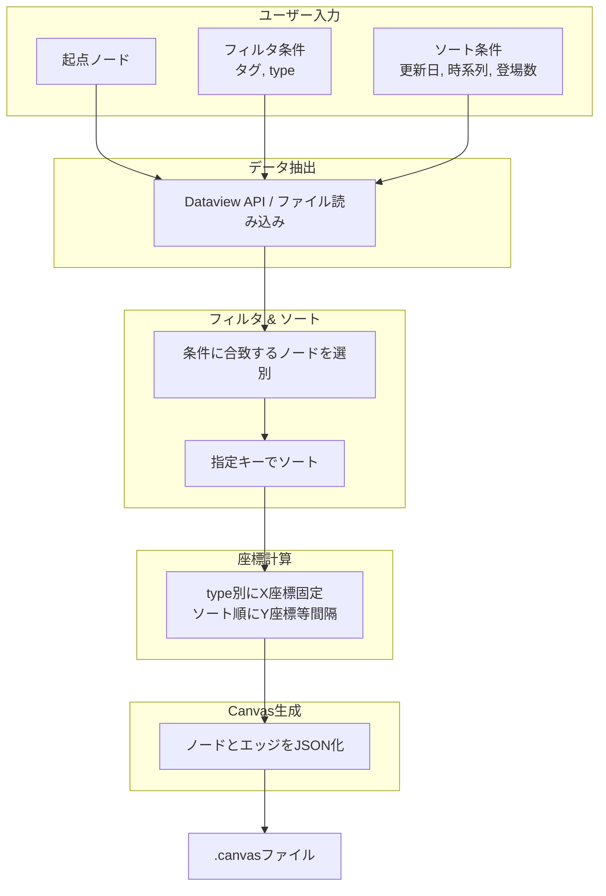

---
title: "obsidianを利用したボトムアップ的canvas生成"
description: "A technical specification for dynamically generating Obsidian Canvas files from structured note metadata using bottom-up data extraction, configurable filtering, and deterministic layout algorithms."
author: "Nanawith7"
layout: default
categories: ["Knowledge Management", "Obsidian", "Data Visualization", "System Architecture"]
tags: ["Obsidian", "Canvas", "Dataview", "Markdown", "YAML", "JSON Canvas", "Bottom-up Generation", "Dynamic Filtering"]
research-date: ["2026-04-19"]
---

# obsidianを利用したボトムアップ的canvas生成

## 1. 概要

Obsidian Vault内のMarkdownノートに埋め込まれた構造化メタデータを源泉とし、ユーザーが指定する動的パラメータに基づいてCanvasファイルを都度生成するシステムの技術仕様を示す。ノートは`type`、`tags`、`date`などのプロパティによって分類され、それらの値に応じてCanvas上のノード配置が決定される。生成プロセスは、データ抽出、フィルタリング、ソート、座標計算、JSONシリアライズの順に進行する。



## 2. データ層：ノートとメタデータ

### 2.1 プロパティ定義

各ノートはYAMLフロントマターによって構造化される。`type`プロパティはノードの種類を識別し、Canvas上の列配置を決定する。任意の`type`値を動的に追加可能であり、新たな値が出現した場合、生成スクリプトはそれに対応する列を自動的に割り当てる。

```yaml
---
type: "character"
tags:
  - "main"
  - "human"
date: "2026-04-19"
related:
  - "[[Scenario A]]"
  - "[[Organization X]]"
---
```

### 2.2 関係性の表現

ノート間の関係はWikiリンク（`[[ ]]`）によって明示される。シナリオノートに登場するキャラクターは、シナリオ側のプロパティにリンクとして列挙される。この方式はデータの単一源泉を確立し、更新時の不整合を防止する。

```yaml
---
type: "scenario"
title: "はじめての冒険"
characters:
  - "[[主人公]]"
  - "[[賢者]]"
---
```

## 3. データ抽出層

### 3.1 Dataviewクエリによる動的抽出

DataviewプラグインのAPIを用いて、起点ノードを中心とした関連ノート群を抽出する。フィルタ条件にはタグ、`type`値、日付範囲などを任意の数で指定できる。ソート条件には`date`（時系列）、`appearances`（登場回数）、`updated`（更新日）などが利用される。

```dataview
TABLE date, type, tags
FROM "path/to/vault"
WHERE contains(type, "scenario") AND contains(tags, "#battle")
SORT date ASC
```

### 3.2 外部スクリプトによるファイル直接解析

Obsidian外部のスクリプト（Python、Node.js）を用いる場合、Vault内のMarkdownファイルを直接走査し、YAMLフロントマターとリンクを解析する。この手法はDataview APIへの依存を排除し、より複雑な座標計算やバッチ処理を可能にする。

## 4. Canvas生成層

### 4.1 レイアウトアルゴリズム

ノードの座標は以下の決定論的ルールに従って計算される。

- **X座標**：ノードの`type`値に対応する列インデックスに基づく。列の幅は固定値`column_width`で乗算される。新規`type`値は既存列の右側に追加される。
- **Y座標**：同一`type`列内において、ソートキーに従った順序で等間隔に配置される。間隔は`row_height`で定義される。
- **エッジ**：ノート間の`[[ ]]`リンク、または`related`プロパティに基づいて生成される。同一ノードペアに複数のリンクが存在する場合、単一のエッジとして扱われる。

### 4.2 JSON Canvas仕様への変換

生成されたノードリストとエッジリストは、JSON Canvas仕様（バージョン1.0）に準拠したオブジェクトに変換され、`.canvas`拡張子を持つファイルとして出力される。

```json
{
  "nodes": [
    {
      "id": "node1",
      "type": "file",
      "file": "主人公.md",
      "x": 0,
      "y": 0,
      "width": 300,
      "height": 200
    }
  ],
  "edges": [
    {
      "id": "edge1",
      "fromNode": "node1",
      "toNode": "node2"
    }
  ]
}
```

### 4.3 パラメータ駆動型生成

生成スクリプトは以下のパラメータを実行時引数または設定ファイルから受け取る。全てのパラメータは任意の数で指定可能であり、指定されなかった場合はデフォルト値または「制限なし」として扱われる。

| パラメータ | 型 | 説明 |
|:---|:---|:---|
| `base_node` | string | 起点となるノートのファイル名またはパス。 |
| `filter_tags` | list | 抽出対象を限定するタグのリスト。 |
| `filter_types` | list | 抽出対象を限定する`type`値のリスト。 |
| `sort_by` | string | ソートキー（`date`, `updated`, `appearances`など）。 |
| `depth` | integer | 起点ノードからのリンク探索深度。 |
| `column_width` | integer | 列間のX方向間隔。 |
| `row_height` | integer | 同一列内ノードのY方向間隔。 |

## 5. 拡張性と保守性

### 5.1 動的type列追加

`type`値の追加はノートのプロパティ編集のみで完結する。生成スクリプトはVault内で使用されている全ての`type`値を収集し、出現順またはアルファベット順に列を割り当てる。事前の列定義ファイルは不要である。

### 5.2 データと表現の分離

ノートの内容およびメタデータは、Canvasの視覚的表現から独立して維持される。同一のデータセットに対して、異なるフィルタ条件やソート条件を適用した複数のCanvasビューを生成できる。

### 5.3 バージョン管理親和性

ノートはMarkdown形式、生成スクリプトはテキストベースのソースコードとしてGitなどのバージョン管理システムで追跡可能である。Canvasファイルは生成物として扱われ、リポジトリから除外することもできる。

## 6. 実装例

以下はPythonによる簡易的な生成スクリプトの擬似コードである。

```python
def generate_canvas(base_node, filter_tags, filter_types, sort_by):
    nodes = extract_nodes(base_node, depth)
    nodes = filter_by_tags_and_types(nodes, filter_tags, filter_types)
    nodes = sort_nodes(nodes, sort_by)
    type_columns = assign_x_coordinates(nodes)
    for node in nodes:
        node.x = type_columns[node.type] * COLUMN_WIDTH
        node.y = nodes.index(node) * ROW_HEIGHT
    canvas_json = build_canvas_json(nodes, edges)
    write_file("output.canvas", canvas_json)
```

## 7. 結論

Obsidian Vault内の構造化メタデータを源泉とし、動的パラメータに基づいてCanvasを生成する本手法は、データの一貫性、保守性、視覚化の柔軟性を両立する。ユーザーはノートへのプロパティ付与という日常的作業を通じて、自動レイアウトされた関係図を任意の視点で取得できる。