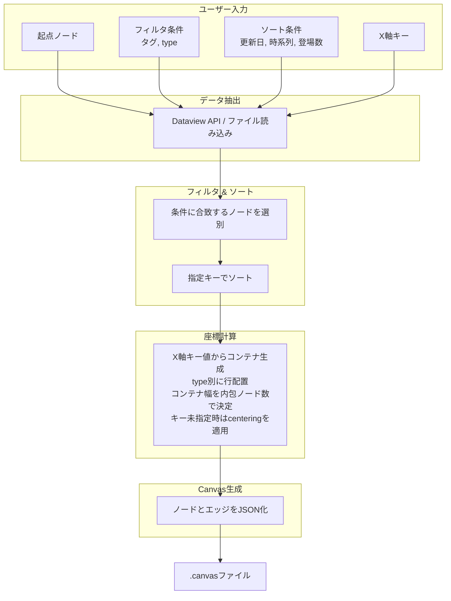

# obsidianを利用したボトムアップ的canvas生成

## 1. 概要

Obsidian Vault内のMarkdownノートに埋め込まれた構造化メタデータを源泉とし、ユーザーが指定する動的パラメータに基づいてCanvasファイルを都度生成するシステムの技術仕様を示す。ノートは`type`、`tags`、`date`などのプロパティによって分類され、それらの値に応じてCanvas上のノード配置が決定される。生成プロセスは、データ抽出、フィルタリング、ソート、座標計算、JSONシリアライズの順に進行する。



## 2. データ層：ノートとメタデータ

### 2.1 プロパティ定義

各ノートはYAMLフロントマターによって構造化される。`type`プロパティはノードの種類を識別し、Canvas上の行配置を決定する。任意の`type`値を動的に追加可能であり、新たな値が出現した場合、生成スクリプトはそれに対応する行を自動的に割り当てる。

`lining`プロパティは、同一`type`行内でのサブ行分割数を指定する。省略時はデフォルト値`1`として扱われ、単一の水平行として配置される。`lining`に`3`が指定された場合、そのtype行は垂直方向に3つのサブ行を持ち、ノードは各サブ行に順次振り分けられる。

`centering`プロパティは、`x_axis_key`パラメータが指定されていない場合に限り有効となり、そのtype行のノードを水平方向にセンタリングするか否かを指定する。値が`true`の場合、当該typeの各サブ行内のノードは、グリッド全体の列幅に対して中央に配置される。

```yaml
---
type: "character"
lining: 3
centering: true
tags:
  - "main"
  - "human"
date: "2026-04-19"
related:
  - "[[Scenario A]]"
  - "[[Organization X]]"
---
```

### 2.2 X軸コンテナ

ノードが持つ任意のプロパティを`x_axis_key`として指定すると、そのキーの値に基づいてX軸上にコンテナが生成される。スクリプトは、フィルタされた全ノードから指定キーの一意な値を収集し、値を昇順にソートした順にコンテナを配置する。各コンテナのX方向の幅は、そのコンテナに属するtypeの中で最大のノード数（`lining`によるサブ行分割後）によって決定される。コンテナ内部では、ノードは左端から順に配置される。あるコンテナに特定のtypeのノードが存在しない場合、そのtype行の当該コンテナ内は空領域となる。

### 2.3 関係性の表現

ノート間の関係はWikiリンク（`[[ ]]`）によって明示される。シナリオノートに登場するキャラクターは、シナリオ側のプロパティにリンクとして列挙される。この方式はデータの単一源泉を確立し、更新時の不整合を防止する。

```yaml
---
type: "scenario"
title: "はじめての冒険"
characters:
  - "[[主人公]]"
  - "[[賢者]]"
---
```

## 3. データ抽出層

### 3.1 Dataviewクエリによる動的抽出

DataviewプラグインのAPIを用いて、起点ノードを中心とした関連ノート群を抽出する。フィルタ条件にはタグ、`type`値、日付範囲などを任意の数で指定できる。ソート条件には`date`（時系列）、`appearances`（登場回数）、`updated`（更新日）などが利用される。

```dataview
TABLE date, type, tags
FROM "path/to/vault"
WHERE contains(type, "scenario") AND contains(tags, "#battle")
SORT date ASC
```

### 3.2 外部スクリプトによるファイル直接解析

Obsidian外部のスクリプト（Python、Node.js）を用いる場合、Vault内のMarkdownファイルを直接走査し、YAMLフロントマターとリンクを解析する。この手法はDataview APIへの依存を排除し、より複雑な座標計算やバッチ処理を可能にする。

## 4. Canvas生成層

### 4.1 レイアウトアルゴリズム

ノードの座標は以下の決定論的ルールに従って計算される。座標系は、**Y軸が垂直方向（type行の縦並び）、X軸が水平方向（コンテナの横並びとコンテナ内でのノードの位置）** として定義される。

`x_axis_key`が指定されていない場合、ノードは単一のグリッドに配置され、`centering`プロパティによる水平方向のセンタリングが有効となる。`x_axis_key`が指定された場合、レイアウトは以下の層で決定される。
1.  **コンテナの生成**: 全ノードから`x_axis_key`の一意な値を収集し、昇順にソートして順序を確定する。この順序に従い、X軸上に各コンテナの始点を設定する。
2.  **コンテナ幅の決定**: 各コンテナの最終的な幅は、そのコンテナに属する全typeの中で最大の実ノード数によって決定される。コンテナ内に1つもノードを持たないtype行は幅の計算から除外される。
3.  **ノードの配置**: コンテナ内部では、ノードは左端から順に等間隔で配置される。`lining`が指定されている場合、ノードはまずサブ行に順次振り分けられ、各サブ行内で左端から配置される。

`x_axis_key`が指定されている場合、各コンテナの幅がデータ駆動で決定されるため、`centering`プロパティは無視される。

- **X座標**: 各コンテナの始点X座標に、ノードのコンテナ内インデックスと`column_width`を乗じた値を加えたもの。コンテナの始点は、その前方にある全コンテナの幅の合計で決定される。

- **Y座標（type行の位置）**: 各ノードの`type`に基づき割り当てられる行のインデックスに`row_height`を乗じたもの。`lining`が指定されている場合は、サブ行のインデックスも加味される。

- **エッジ**: ノート間の`[[ ]]`リンク、または`related`プロパティに基づいて生成される。同一ノードペアに複数のリンクが存在する場合、単一のエッジとして扱われる。

#### 配置の視覚的イメージ

`year`を`x_axis_key`として、以下のノード群を配置した結果を示す。

- **2024年**: 2024, EVENT-A, STORY-1, STORY-2, STORY-3 を内包する。STORYのノード数3が最大のため、この年のコンテナ幅は3となる。
- **2025年**: 2025, EVENT-B, EVENT-C, STORY-4, STORY-5, STORY-6 を内包する。STORYのノード数3が最大のため、この年のコンテナ幅は3となる。
- **2026年**: 2026, EVENT-D, EVENT-E, STORY-7 を内包する。EVENTのノード数2が最大のため、この年のコンテナ幅は2となる。
- **2027年**: 2027, STORY-8, STORY-9 を内包する。STORYのノード数2が最大のため、この年のコンテナ幅は2となる。

```
YEAR-ROW  | 2024   | (空)   | (空)   || 2025   | (空)   | (空)   || 2026   | (空)   || 2027   | (空)   |
EVENT-ROW | A      | (空)   | (空)   || B      | C      | (空)   || D      | E      || (空)   | (空)   |
STORY-ROW | 1      | 2      | 3      || 4      | 5      | 6      || 7      | (空)   || 8      | 9      |
```

全typeのノードが同一の時間軸に沿って整列し、一部のtypeでデータが存在しないコンテナ内は空領域となる。コンテナの幅は内包する最大ノード数に応じて変化し、情報密度の高い年ほど広いスペースが割り当てられる。`lining`が指定されたtype行では、各コンテナ内でさらに細分化されたサブ行にノードが配置される。

### 4.2 JSON Canvas仕様への変換

生成されたノードリストとエッジリストは、JSON Canvas仕様（バージョン1.0）に準拠したオブジェクトに変換され、`.canvas`拡張子を持つファイルとして出力される。

```json
{
  "nodes": [
    {
      "id": "node1",
      "type": "file",
      "file": "主人公.md",
      "x": 0,
      "y": 0,
      "width": 300,
      "height": 200
    }
  ],
  "edges": [
    {
      "id": "edge1",
      "fromNode": "node1",
      "toNode": "node2"
    }
  ]
}
```

### 4.3 パラメータ駆動型生成

生成スクリプトは以下のパラメータを実行時引数または設定ファイルから受け取る。全てのパラメータは任意の数で指定可能であり、指定されなかった場合はデフォルト値または「制限なし」として扱われる。

| パラメータ | 型 | 説明 |
|:---|:---|:---|
| `base_node` | string | 起点となるノートのファイル名またはパス。 |
| `filter_tags` | list | 抽出対象を限定するタグのリスト。 |
| `filter_types` | list | 抽出対象を限定する`type`値のリスト。 |
| `sort_by` | string | ソートキー（`date`, `updated`, `appearances`など）。 |
| `depth` | integer | 起点ノードからのリンク探索深度。 |
| `x_axis_key` | string | X軸上にコンテナを生成するためのプロパティ名。指定されたキーの一意な値ごとにコンテナが作られる。 |
| `column_width` | integer | コンテナ内でノードを配置する際の、単位インデックスあたりのX方向間隔。 |
| `row_height` | integer | 行間のY方向間隔。 |

## 5. 拡張性と保守性

### 5.1 動的type行追加

`type`値の追加はノートのプロパティ編集のみで完結する。生成スクリプトはVault内で使用されている全ての`type`値を収集し、出現順またはアルファベット順に行を割り当てる。事前の行定義ファイルは不要である。

### 5.2 動的lining調整

`lining`値の変更もノートのプロパティ編集のみで完結する。同一type内でのサブ行数は`lining`値に応じて動的に調整され、ノードの振り分けはソートキーに基づいて自動的に行われる。`x_axis_key`が指定されたコンテナモードでも、コンテナ内のサブ行分割として機能し続ける。

### 5.3 Centering制御

`centering`プロパティによる水平方向センタリングは`x_axis_key`未指定時に有効となり、type行ごとに独立して設定可能である。指定されたtype行のノードは、グリッド全体の最大列幅に対して中央に配置される。この制御は`lining`によるサブ行分割とも協調し、各サブ行内でセンタリングが適用される。

### 5.4 データ駆動のコンテナ

`x_axis_key`が指定された場合、X軸上の区切りとその幅はデータによってのみ決定される。特定のコンテナ内のノード数に応じてコンテナ幅が変化するため、情報の密度に応じた視覚的なスペース配分が自動的に行われる。

### 5.5 データと表現の分離

ノートの内容およびメタデータは、Canvasの視覚的表現から独立して維持される。同一のデータセットに対して、異なるフィルタ条件やソート条件、X軸分割を適用した複数のCanvasビューを生成できる。

### 5.6 バージョン管理親和性

ノートはMarkdown形式、生成スクリプトはテキストベースのソースコードとしてGitなどのバージョン管理システムで追跡可能である。Canvasファイルは生成物として扱われ、リポジトリから除外することもできる。

## 6. 実装例

以下はPythonによる簡易的な生成スクリプトの擬似コードである。

```python
def generate_canvas(base_node, filter_tags, filter_types, sort_by, x_axis_key):
    nodes = extract_nodes(base_node, depth)
    nodes = filter_by_tags_and_types(nodes, filter_tags, filter_types)
    nodes = sort_nodes(nodes, sort_by)
    
    if x_axis_key:
        # コンテナとその内部ノード数の決定
        containers = build_containers(nodes, x_axis_key)
        container_widths = compute_container_widths(containers, COLUMN_WIDTH)
        
        all_canvas_nodes = []
        for container in containers:
            # コンテナ内にtype行とサブ行を生成
            type_rows = assign_y_coordinates(container.nodes, ROW_HEIGHT)
            for type_name, row_nodes in type_rows.items():
                subrow_assignments = assign_subrows(row_nodes, get_lining(row_nodes[0]))
                for subrow in subrow_assignments:
                    node_x = container.start_x
                    for node in subrow.nodes:
                        node.x = node_x
                        node.y = subrow.y
                        node_x += COLUMN_WIDTH
                        all_canvas_nodes.append(node)
    else:
        # 従来のグリッドレイアウト（centering対応を含む）
        all_canvas_nodes = []
        type_rows = assign_y_coordinates(nodes, ROW_HEIGHT)
        for type_name, row_nodes in type_rows.items():
            # 全typeでの最大ノード数を取得。ここだけはグローバルに見る。
            max_cols = max([len(nodes) for nodes in type_rows.values()])
            subrow_assignments = assign_subrows(row_nodes, get_lining(row_nodes[0]))

            for subrow in subrow_assignments:
                # centeringプロパティが有効ならtrue
                if get_centering(subrow.nodes[0]):
                    x_pos = (max_cols - len(subrow.nodes)) * COLUMN_WIDTH / 2
                else:
                    x_pos = 0
                
                sub_y = subrow.y
                for node in subrow.nodes:
                    node.x = x_pos
                    node.y = sub_y
                    x_pos += COLUMN_WIDTH
                    all_canvas_nodes.append(node)
    
    canvas_json = build_canvas_json(all_canvas_nodes, edges)
    write_file("output.canvas", canvas_json)
```

## 7. 結論

Obsidian Vault内の構造化メタデータを源泉とし、動的パラメータに基づいてCanvasを生成する本手法は、データの一貫性、保守性、視覚化の柔軟性を両立する。ユーザーはノートへのプロパティ付与という日常的作業を通じて、自動レイアウトされた関係図を任意の視点で取得できる。`lining`プロパティによるサブ行分割、`centering`プロパティによる水平方向センタリング、そして`x_axis_key`パラメータによるデータ駆動のコンテナ配置により、データの欠損は視覚的な空白として自然に表現され、情報の密度に応じたスペース配分が実現される。