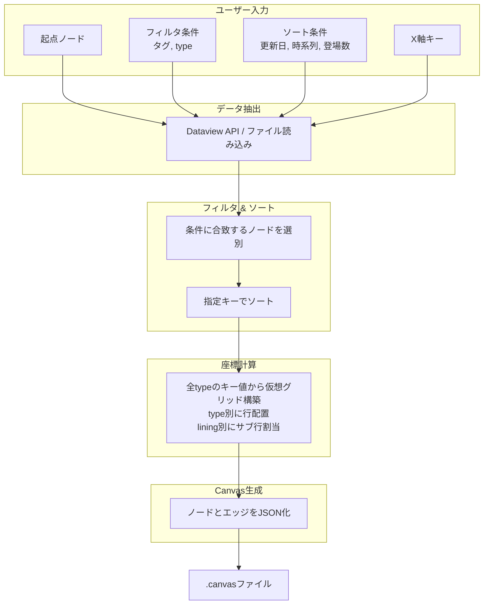

# obsidianを利用したボトムアップ的canvas生成

## 1. 概要

Obsidian Vault内のMarkdownノートに埋め込まれた構造化メタデータを源泉とし、ユーザーが指定する動的パラメータに基づいてCanvasファイルを都度生成するシステムの技術仕様を示す。ノートは`type`、`tags`、`date`などのプロパティによって分類され、それらの値に応じてCanvas上のノード配置が決定される。生成プロセスは、データ抽出、フィルタリング、ソート、座標計算、JSONシリアライズの順に進行する。



## 2. データ層：ノートとメタデータ

### 2.1 プロパティ定義

各ノートはYAMLフロントマターによって構造化される。`type`プロパティはノードの種類を識別し、Canvas上の行配置を決定する。任意の`type`値を動的に追加可能であり、新たな値が出現した場合、生成スクリプトはそれに対応する行を自動的に割り当てる。

`lining`プロパティは、同一`type`行内でのサブ行分割数を指定する。省略時はデフォルト値`1`として扱われ、単一の水平行として配置される。`lining`に`3`が指定された場合、そのtype行は垂直方向に3つのサブ行を持ち、ノードは各サブ行に順次振り分けられる。

```yaml
---
type: "character"
lining: 3
tags:
  - "main"
  - "human"
date: "2026-04-19"
related:
  - "[[Scenario A]]"
  - "[[Organization X]]"
---
```

### 2.2 X軸仮想グリッド

ノードが持つ任意のプロパティを`x_axis_key`として指定すると、全ノードの共通時間軸（仮想グリッド）が構築される。スクリプトは、指定されたキー（例: `year`）の値を**すべてのtypeのノード**から収集し、一意な値を昇順に並べたグローバルな列軸を生成する。このグローバル軸がすべてのtype行で共有され、ノードは自身のプロパティ値に合致する列に配置される。

この方式により、あるtype（例: `YEAR`）のノード数が少なくとも、別のtype（例: `EVENT`）のノードが持つ値によって列が補完される。結果として、時系列の欠落がない、完全なタイムラインが形成される。

### 2.3 関係性の表現

ノート間の関係はWikiリンク（`[[ ]]`）によって明示される。シナリオノートに登場するキャラクターは、シナリオ側のプロパティにリンクとして列挙される。この方式はデータの単一源泉を確立し、更新時の不整合を防止する。

```yaml
---
type: "scenario"
title: "はじめての冒険"
characters:
  - "[[主人公]]"
  - "[[賢者]]"
---
```

## 3. データ抽出層

### 3.1 Dataviewクエリによる動的抽出

DataviewプラグインのAPIを用いて、起点ノードを中心とした関連ノート群を抽出する。フィルタ条件にはタグ、`type`値、日付範囲などを任意の数で指定できる。ソート条件には`date`（時系列）、`appearances`（登場回数）、`updated`（更新日）などが利用される。

```dataview
TABLE date, type, tags
FROM "path/to/vault"
WHERE contains(type, "scenario") AND contains(tags, "#battle")
SORT date ASC
```

### 3.2 外部スクリプトによるファイル直接解析

Obsidian外部のスクリプト（Python、Node.js）を用いる場合、Vault内のMarkdownファイルを直接走査し、YAMLフロントマターとリンクを解析する。この手法はDataview APIへの依存を排除し、より複雑な座標計算やバッチ処理を可能にする。

## 4. Canvas生成層

### 4.1 レイアウトアルゴリズム

ノードの座標は以下の決定論的ルールに従って計算される。座標系は、**Y軸が垂直方向（type行の縦並び）、X軸が水平方向（各行内でのノードの横配置）** として定義される。

`x_axis_key`が指定された場合、レイアウトは以下の三層で決定される。
1.  **仮想グリッドの構築（全type共通）**：全ノードから`x_axis_key`の値を収集し、昇順ソートされた一意な値のリストをグローバルな列軸として生成する。
2.  **type行の配置（Y軸）**：各列内で、ノードの`type`値に対応する行インデックスに基づき、type行全体のY座標が決定される。
3.  **サブ行の配置（lining）**：各type行は`lining`値に応じてサブ行に分割され、ノードはソート順に従って各サブ行内の適切な列に配置される。

本モードでは、各列の位置と幅がグローバル軸によって固定されるため、`centering`プロパティは**自動的に無効化**される。

- **X座標（仮想グリッドの列位置）**：
  1.  `x_axis_key`が指定された場合、スクリプトはフィルタされた**全typeの全ノード**を走査し、指定キーの一意な値をすべて収集する。
  2. それらを昇順にソートし、列インデックスを割り当てる。各列のX座標は`列インデックス * column_width`で決定される。
  3. ノードは自身のプロパティ値に応じて、該当する列のX座標に配置される。

- **Y座標（type行の位置）**：
  1.  各列内で、ノードの`type`値に対応する行インデックスに基づき、type行全体のY座標が決定される。行の高さは固定値`row_height`で乗算される。
  2.  新規`type`値は既存行の下側に追加される。各type行は、`lining`値に応じて`lining`個のサブ行に分割され、行全体の占有高さは`lining * row_height`となる。
  3.  同一typeに属するノードは、ソートキーに従った順序でサブ行に順次振り分けられる。各サブ行内のノード数は、全列にわたる配置のため制限されない。

- **エッジ**：ノート間の`[[ ]]`リンク、または`related`プロパティに基づいて生成される。同一ノードペアに複数のリンクが存在する場合、単一のエッジとして扱われる。

#### 配置の視覚的イメージ

以下の例は、`year`を`x_axis_key`とし、YEAR type（`lining=1`、ノード数4）、EVENT type（`lining=1`、ノード数4）、STORY type（`lining=1`、ノード数6）が配置されたCanvasを示す。全ノードの`year`値から収集されたグローバル軸は、2024〜2029の6列となる。YEARノードは4年分のみ、EVENTノードも一部の年にしか存在しないが、グローバル軸によって列が補完され、欠落したセルは`EMPTY`として表示される。

```
YEAR-ROW  | 2024 | 2025 | 2026 | 2027 | EMPTY | EMPTY |
EVENT-ROW | A    | EMPTY| B    | C    | EMPTY | D     |
STORY-ROW | 1    | 2    | 3    | 4    | 5     | 6     |
```

全typeのノードが同一の時間軸に沿って整列し、一部のtypeでデータが存在しない時点もグリッドに組み込まれることで、完全なタイムラインが形成される。`lining`が指定されたtype行では、各列内でさらに細分化されたサブ行にノードが配置される。

### 4.2 JSON Canvas仕様への変換

生成されたノードリストとエッジリストは、JSON Canvas仕様（バージョン1.0）に準拠したオブジェクトに変換され、`.canvas`拡張子を持つファイルとして出力される。

```json
{
  "nodes": [
    {
      "id": "node1",
      "type": "file",
      "file": "主人公.md",
      "x": 0,
      "y": 0,
      "width": 300,
      "height": 200
    }
  ],
  "edges": [
    {
      "id": "edge1",
      "fromNode": "node1",
      "toNode": "node2"
    }
  ]
}
```

### 4.3 パラメータ駆動型生成

生成スクリプトは以下のパラメータを実行時引数または設定ファイルから受け取る。全てのパラメータは任意の数で指定可能であり、指定されなかった場合はデフォルト値または「制限なし」として扱われる。

| パラメータ | 型 | 説明 |
|:---|:---|:---|
| `base_node` | string | 起点となるノートのファイル名またはパス。 |
| `filter_tags` | list | 抽出対象を限定するタグのリスト。 |
| `filter_types` | list | 抽出対象を限定する`type`値のリスト。 |
| `sort_by` | string | ソートキー（`date`, `updated`, `appearances`など）。 |
| `depth` | integer | 起点ノードからのリンク探索深度。 |
| `x_axis_key` | string | 全typeのノードから共通の仮想グリッドを生成するためのプロパティ名。指定時は全ノードの一意な値が列軸となる。 |
| `column_width` | integer | 同一サブ行内のノード間のX方向間隔。 |
| `row_height` | integer | 行間のY方向間隔。 |

## 5. 拡張性と保守性

### 5.1 動的type行追加

`type`値の追加はノートのプロパティ編集のみで完結する。生成スクリプトはVault内で使用されている全ての`type`値を収集し、出現順またはアルファベット順に行を割り当てる。事前の行定義ファイルは不要である。

### 5.2 動的lining調整

`lining`値の変更もノートのプロパティ編集のみで完結する。同一type内でのサブ行数は`lining`値に応じて動的に調整され、ノードの振り分けはソートキーに基づいて自動的に行われる。`x_axis_key`が指定された仮想グリッドモードでも、列内のサブ行分割として機能し続ける。

### 5.3 グローバル仮想グリッドによる完全なタイムライン

`x_axis_key`が指定された場合、全typeのノードから収集された一意なキー値によってグローバルな列軸が構築される。いずれかのtypeに欠落している時点があっても、他のtypeのノードがその時点のデータを持っていれば、列は補完される。これにより、データの欠損に強い完全なタイムラインが形成される。

### 5.4 データと表現の分離

ノートの内容およびメタデータは、Canvasの視覚的表現から独立して維持される。同一のデータセットに対して、異なるフィルタ条件やソート条件、X軸分割を適用した複数のCanvasビューを生成できる。

### 5.5 バージョン管理親和性

ノートはMarkdown形式、生成スクリプトはテキストベースのソースコードとしてGitなどのバージョン管理システムで追跡可能である。Canvasファイルは生成物として扱われ、リポジトリから除外することもできる。

## 6. 実装例

以下はPythonによる簡易的な生成スクリプトの擬似コードである。

```python
def generate_canvas(base_node, filter_tags, filter_types, sort_by, x_axis_key):
    nodes = extract_nodes(base_node, depth)
    nodes = filter_by_tags_and_types(nodes, filter_tags, filter_types)
    nodes = sort_nodes(nodes, sort_by)
    
    # 仮想グリッドの構築
    if x_axis_key:
        all_values = get_all_property_values(nodes, x_axis_key)
        global_column_order = sorted(list(set(all_values)))
    else:
        global_column_order = None
    
    # 各列内でtype行のY座標を割り当て、サブ行を構築
    all_canvas_nodes = []
    if global_column_order:
        for col_index, col_value in enumerate(global_column_order):
            x_position = col_index * COLUMN_WIDTH
            col_nodes = [n for n in nodes if get_property(n, x_axis_key) == col_value]
            type_rows = assign_y_coordinates(col_nodes, ROW_HEIGHT)
            for type_name, row_nodes in type_rows.items():
                subrow_assignments = assign_subrows(row_nodes, get_lining(row_nodes[0]))
                for subrow in subrow_assignments:
                    node_x = x_position
                    for node in subrow.nodes:
                        node.x = node_x
                        node.y = subrow.y
                        all_canvas_nodes.append(node)
    else:
        # 従来のグリッドレイアウト（centering対応を含む）
        pass
    
    canvas_json = build_canvas_json(all_canvas_nodes, edges)
    write_file("output.canvas", canvas_json)
```

## 7. 結論

Obsidian Vault内の構造化メタデータを源泉とし、動的パラメータに基づいてCanvasを生成する本手法は、データの一貫性、保守性、視覚化の柔軟性を両立する。ユーザーはノートへのプロパティ付与という日常的作業を通じて、自動レイアウトされた関係図を任意の視点で取得できる。`lining`プロパティによるサブ行分割、そして`x_axis_key`パラメータによる全type共通の仮想グリッド構築により、時系列やカテゴリの欠損を補完した完全なタイムラインビューが実現される。