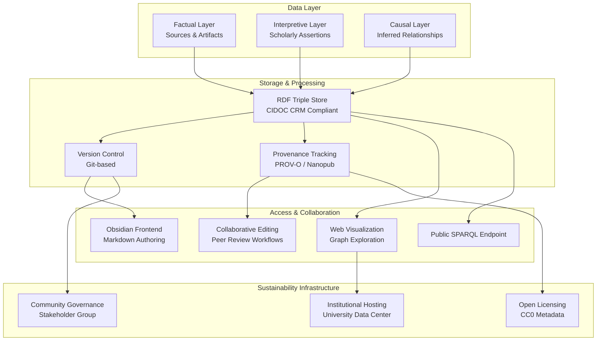
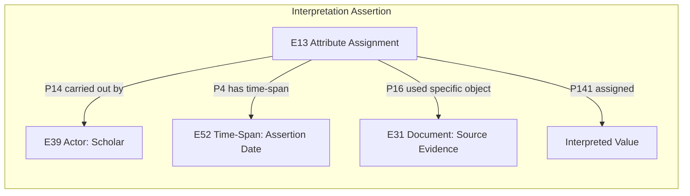
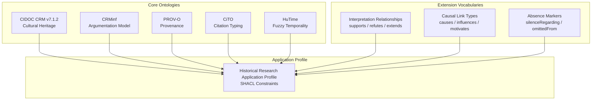
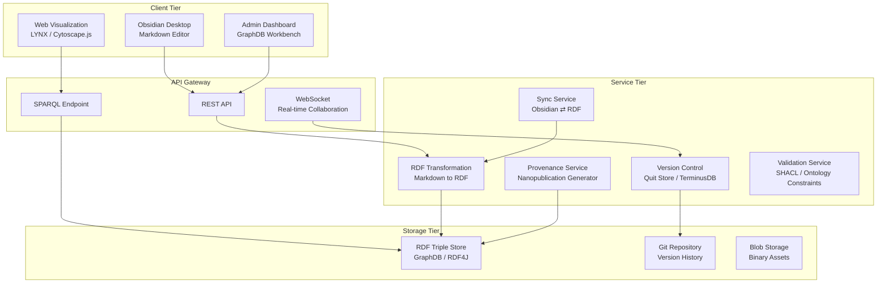
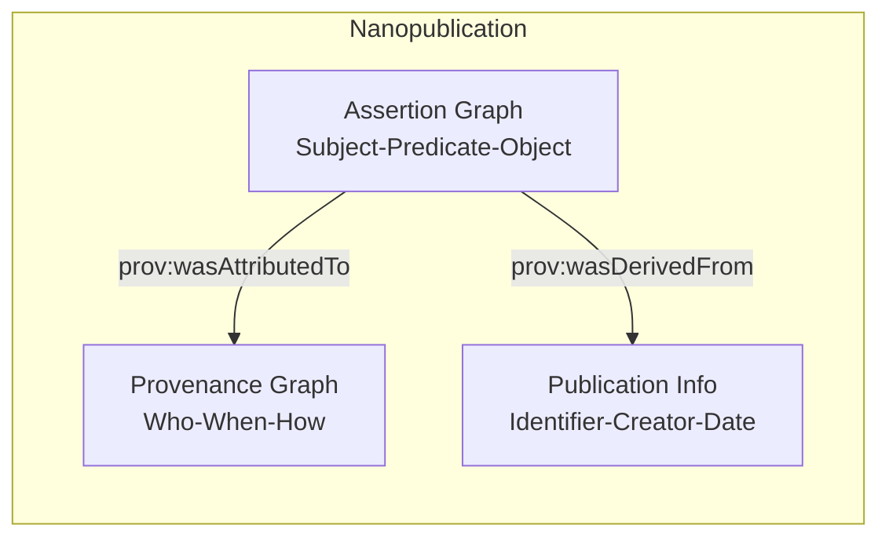
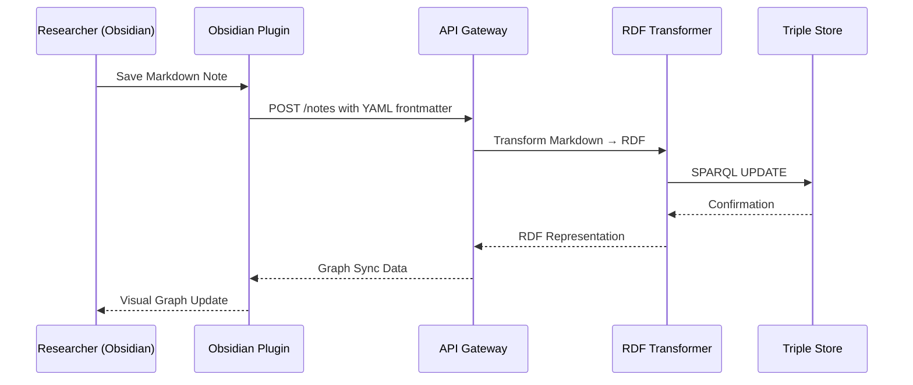
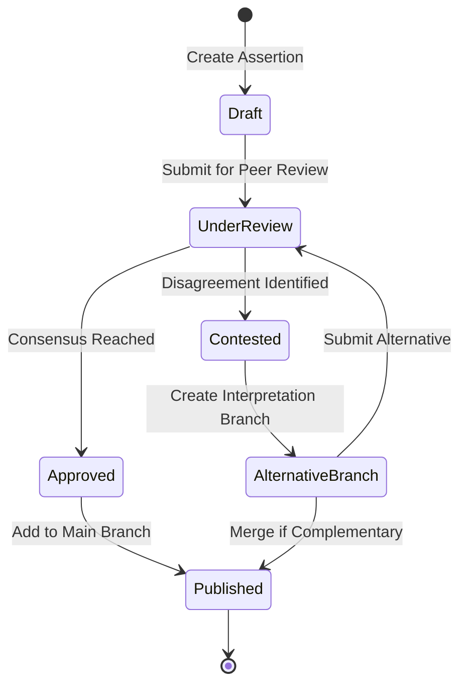
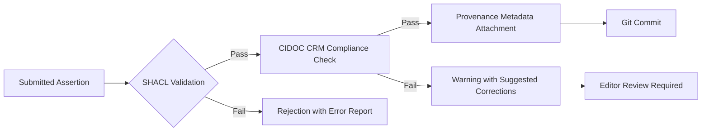

# Architecture for Historical Knowledge Graph Visualization and Collaborative Research Infrastructure

## 1. Overview

A collaborative knowledge graph system designed for historical research enables the structured representation of primary sources, scholarly interpretations, and inferred causal relationships. The architecture integrates three distinct data layers within a graph database framework, supporting both expert collaboration and public resource accessibility. The system emphasizes provenance tracking, version control, and standards-based data modeling to ensure long-term sustainability and interoperability with established digital humanities infrastructures.



## 2. Data Model Architecture

### 2.1 Three-Layer Knowledge Representation

The system models historical knowledge using three interconnected layers, each with distinct ontological commitments and provenance requirements.

| Layer | Content Type | Primary Standard | Provenance Mechanism |
| :--- | :--- | :--- | :--- |
| **Factual Layer** | Primary sources, artifact metadata, temporal-spatial coordinates, textual transcriptions | CIDOC CRM | Direct source citation |
| **Interpretive Layer** | Scholarly assertions, competing hypotheses, attribution claims, dating estimations | CIDOC CRM E13 Attribute Assignment | Nanopublication with PROV-O |
| **Causal Layer** | Inferred causal links, influence relationships, counterfactual absence markers, motivation hypotheses | Extension vocabulary | RDF-star qualified statements |

#### 2.1.1 Factual Layer Implementation

The factual layer employs CIDOC CRM as the core ontology for cultural heritage information. Primary source entities are represented as `E31 Document` or `E73 Information Object` instances, linked to physical artifacts (`E22 Human-Made Object`) via `P128 carries` relationships. Temporal information uses `E52 Time-Span` with `P82a begin of the begin` and `P82b end of the end` properties for precise interval representation.

#### 2.1.2 Interpretive Layer Implementation

Multiple competing interpretations are managed through CIDOC CRM `E13 Attribute Assignment` class, which explicitly permits "contradictory sets of values" for the same property. Each interpretation is modeled as:



This structure allows parallel coexistence of contradictory claims regarding dating, authorship attribution, or event interpretation.

#### 2.1.3 Causal Layer Implementation

Causal relationships and inferred motivations are represented using RDF-star to attach contextual metadata directly to triple statements. The model distinguishes:

- **Positive causality**: `<<:eventA :causes :eventB>> :assertedBy :scholarX ; :basedOn :sourceY`
- **Motivation hypotheses**: `<<:personA :authored :documentB>> :motivationHypothesis "financial support" ; :evidence :letterC`
- **Documented absence**: `:eventX :notReferencedIn :sourceZ` with explicit metadata indicating the significance of omission

Fuzzy temporal intervals for uncertain dates utilize the HuTime ontology pattern, storing `earliestPossible` and `latestPossible` bounds rather than precise dates.

### 2.2 Ontology Stack



## 3. System Architecture

### 3.1 Component Overview

The architecture follows a three-tier pattern with clear separation between storage, business logic, and presentation layers.



### 3.2 Storage Selection: RDF Triple Store

| Criteria | RDF Triple Store (GraphDB) | Labeled Property Graph (Neo4j) |
| :--- | :--- | :--- |
| CIDOC CRM Compliance | Native support via ontology import | Requires neosemantics plugin |
| Inference Capabilities | Built-in RDFS/OWL reasoning | Application-layer implementation |
| Standard Query Language | SPARQL 1.1 | Cypher (proprietary) |
| Provenance Tracking | RDF-star / Named Graphs | Property-based workarounds |
| Semantic Web Interoperability | Direct Linked Data publishing | Export-dependent |
| Community Adoption in DH | Widespread (FactGrid, CHAD-KG) | Growing (Romans 1by1) |

The RDF triple store approach is selected due to native alignment with CIDOC CRM and the broader Semantic Web ecosystem.

### 3.3 Version Control: Git-Based RDF Management

Quit Store provides a SPARQL endpoint that persists all updates as Git commits within a repository. This enables:

- **Branching for competing interpretations**: Researchers maintain separate branches for alternative historiographical frameworks.
- **Commit-level provenance**: Each SPARQL UPDATE operation generates a signed commit with author metadata.
- **Merge workflows**: Divergent interpretation branches can be merged with conflict resolution protocols.
- **Time-travel queries**: Historical states of the knowledge graph are queryable via commit references.

Alternative implementations include TerminusDB for document-graph hybrid versioning and GraphWorld for agent-based collaborative editing environments.

### 3.4 Provenance Infrastructure

The provenance system combines two complementary standards:

| Component | Standard | Function |
| :--- | :--- | :--- |
| **Provenance Vocabulary** | W3C PROV-O | Describes entities, activities, and agents involved in assertion creation |
| **Assertion Packaging** | Nanopublication | Bundles assertion, provenance, and publication metadata into citable units |



Each scholarly interpretation exists as an independently citable nanopublication with a Trusty URI identifier.

### 3.5 Citation Typing with CiTO

The Citation Typing Ontology (CiTO) enables explicit characterization of citation intent:

| CiTO Property | Interpretation in Historical Context |
| :--- | :--- |
| `cito:supports` | One interpretation corroborates another |
| `cito:refutes` | One interpretation contradicts another |
| `cito:extends` | One interpretation builds upon and expands another |
| `cito:usesDataFrom` | Interpretation derived from specified primary source |
| `cito:citesAsAuthority` | Reference to established scholarly consensus |

### 3.6 Obsidian Integration Strategy

Obsidian serves as the primary authoring environment for researchers. The integration employs a hybrid synchronization model:



The Obsidian vault structure maps to CIDOC CRM entities via YAML frontmatter properties:

```yaml
---
crm_class: E31_Document
crm_id: "https://example.org/document/123"
p4_time_span: "1568-1574"
p16_used_specific_object: ["https://example.org/archive/letter_45"]
interpretation_assertions:
  - property: "P2_has_type"
    value: "eyewitness_account"
    assigned_by: "https://orcid.org/0000-0002-1825-0097"
    evidence: "https://example.org/archive/correspondence_12"
    confidence: "high"
---
```

### 3.7 Visualization Layer

The visualization architecture supports dual-mode exploration:

| Mode | Technology | Use Case |
| :--- | :--- | :--- |
| **2D Force-Directed Graph** | Cytoscape.js | Hypothesis verification, relationship tracing, source network analysis |
| **3D Semantic Galaxy** | LYNX Framework | Exploratory discovery, conceptual clustering, serendipitous connection identification |

LYNX demonstrates 60 FPS performance with 10,000+ node datasets and sub-200ms search latency, suitable for large-scale historical knowledge graphs.

## 4. Collaborative Infrastructure

### 4.1 Editorial Workflow



### 4.2 Peer Review Model

Unlike consensus-convergent models typical in scientific knowledge graphs, the historical research infrastructure accommodates persistent interpretive pluralism. The review process evaluates:

- **Evidentiary basis**: Completeness and relevance of cited sources
- **Logical coherence**: Internal consistency of the interpretive argument
- **Transparency**: Clarity of provenance and methodological assumptions
- **Relationship to existing interpretations**: Explicit characterization using CiTO vocabulary

Both approved and contested interpretations remain accessible, with the latter preserved in separate Git branches or as parallel `E13 Attribute Assignment` instances.

### 4.3 Community Governance Structure

The governance model draws from established open knowledge platforms:

| Component | Reference Model | Implementation |
| :--- | :--- | :--- |
| **Editorial Access** | FactGrid | Registered researcher accounts; all edits versioned and attributable |
| **Quality Assurance** | DDE KG Editor | Community peer review with contribution records |
| **Policy Development** | Wikibase Stakeholder Group | Domain-specific steering committee |
| **Federated Data Sharing** | Finno-Ugric Data Sharing Space | Staged publication from private to public data spaces |

### 4.4 Collaborative Features

- **Real-time presence indicators**: WebSocket notifications of concurrent editors
- **Inline discussion threads**: Annotation linked to specific RDF statements
- **Change proposals**: Merge request workflow for substantial revisions
- **Contribution metrics**: Public record of editorial activity for academic recognition

## 5. Sustainability Framework

### 5.1 Open Licensing Policy

| Data Category | License | Rationale |
| :--- | :--- | :--- |
| Knowledge Graph Metadata | CC0 1.0 | Maximize interoperability and reuse |
| Primary Source Transcriptions | CC BY-SA 4.0 | Preserve attribution while enabling derivative works |
| Scholarly Interpretations | CC BY 4.0 | Require attribution for academic credit |
| Software Components | MIT / Apache 2.0 | Open source development model |

The CC0 metadata policy aligns with Europeana and FactGrid precedents, while acknowledging that academic citation norms operate as a parallel social contract independent of legal obligation.

### 5.2 Institutional Hosting Model

The sustainability strategy follows the "embedded infrastructure" pattern:

```mermaid
graph TD
    subgraph "Financial Sustainability"
        F1[Research Grants<br>Initial Development]
        F2[NFDI / National Infrastructure<br>Ongoing Operations]
        F3[University Hosting<br>Perpetual Commitment]
    end

    subgraph "Technical Sustainability"
        T1[Open Source Stack<br>Community Maintenance]
        T2[Standard Ontologies<br>Long-term Compatibility]
        T3[Static Export Pipeline<br>Preservation Format]
    end

    subgraph "Community Sustainability"
        C1[Academic Recognition<br>Contribution Incentives]
        C2[Training & Documentation<br>Onboarding Pipeline]
        C3[Federated Ecosystem<br>Distributed Responsibility]
    end

    F1 --> F2
    F2 --> F3
    T1 --> T2
    T2 --> T3
    C1 --> C2
    C2 --> C3
```



The FactGrid precedent demonstrates viability: operational costs covered by NFDI4Memory consortium funding with unlimited operational guarantee from the University of Erfurt.

### 5.3 Long-term Preservation Strategy

| Preservation Tier | Method | Access Level |
| :--- | :--- | :--- |
| **Active Service** | Live SPARQL endpoint with full collaborative features | Daily operations |
| **Static Archive** | Annual RDF dump and static site generation | Perpetual reference |
| **Institutional Repository** | Deposit in university digital preservation system | Guaranteed permanence |

The static export pipeline generates a browse-only version of the knowledge graph using Gatsby or Hugo with Cytoscape.js visualization, reducing long-term maintenance costs while preserving accessibility.

### 5.4 Funding Model Composition

| Funding Source | Phase | Proportion |
| :--- | :--- | :--- |
| Research Council Grants | Development (Years 1-3) | 60% |
| National Research Data Infrastructure | Operation (Years 3+) | 50% |
| Institutional Host Contribution | Ongoing | 30% |
| Community Membership Fees | Ongoing | 20% |

## 6. Technical Specifications

### 6.1 Minimum Viable Product Requirements

| Component | Technology Selection | Justification |
| :--- | :--- | :--- |
| Triple Store | GraphDB Free Edition | RDF-star support, SHACL validation, open-source workbench |
| Version Control | Quit Store | Git-integrated SPARQL endpoint |
| API Layer | Node.js / Express | RESTful endpoints for Obsidian integration |
| Frontend Visualization | Cytoscape.js | Mature library with extensive documentation |
| Obsidian Plugin | Prototype-11 pattern | Markdown-to-RDF transformation pipeline |
| Deployment | Docker Compose | Simplified orchestration for academic environments |

### 6.2 Performance Benchmarks

| Metric | Target | Measurement Method |
| :--- | :--- | :--- |
| SPARQL Query Latency | < 500ms (95th percentile) | Benchmark with 1M triple dataset |
| Graph Visualization Render | < 2s for 5,000 nodes | Browser performance profiling |
| Concurrent Editors | 50 simultaneous | Load testing with WebSocket connections |
| Version Commit Throughput | 100 commits/minute | Git performance under SPARQL UPDATE load |

### 6.3 Security and Access Control

| Access Level | Permissions | Authentication Method |
| :--- | :--- | :--- |
| **Public** | Read-only SPARQL queries, graph exploration | None |
| **Registered Researcher** | Create/edit assertions, propose interpretations | ORCID OAuth |
| **Reviewer** | Approve/reject change proposals, annotate | ORCID + role assignment |
| **Administrator** | Ontology updates, user management, branch merging | Institutional SSO |

### 6.4 Data Validation Pipeline



## 7. Implementation Roadmap

| Phase | Duration | Deliverables |
| :--- | :--- | :--- |
| **Phase 1: Core Infrastructure** | 6 months | RDF triple store deployment, CIDOC CRM import, basic SPARQL endpoint |
| **Phase 2: Authoring Environment** | 4 months | Obsidian plugin prototype, Markdown-to-RDF transformer, version control integration |
| **Phase 3: Collaboration Layer** | 5 months | User authentication, peer review workflows, nanopublication generator |
| **Phase 4: Visualization Suite** | 3 months | Cytoscape.js integration, LYNX 3D viewer, faceted search interface |
| **Phase 5: Public Launch** | 2 months | Public SPARQL endpoint, documentation, training materials |
| **Phase 6: Sustainability Transition** | Ongoing | NFDI funding application, institutional hosting agreement, community governance establishment |

## 8. Evaluation Metrics

| Dimension | Indicator | Target |
| :--- | :--- | :--- |
| **Technical** | System uptime | 99.5% monthly |
| **Community** | Active contributors | 50+ registered researchers |
| **Content** | Assertion count | 100,000+ nanopublications |
| **Impact** | External citations | 200+ scholarly references |
| **Sustainability** | Operational funding secured | 5-year commitment |

