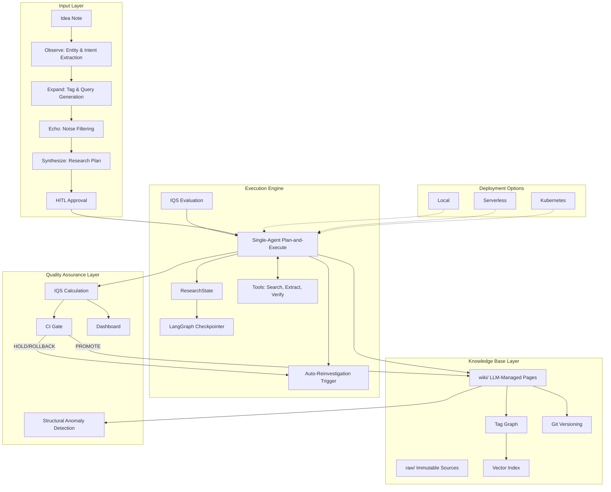
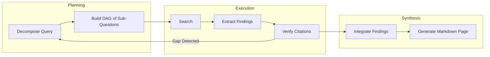

# Idea-Optimized Personalized Auto-Generative Knowledge Base Design

## 1. System Overview

The system transforms user-submitted idea notes into a structured, navigable knowledge base. It automates tag suggestion, multi-stage deep research, and persistent storage of synthesized findings as interlinked Markdown files. The architecture emphasizes traceability, incremental updates, and integrated quality scoring.



## 2. Input Layer: Idea Note Transformation

The input layer converts a free-text idea note into a structured research plan and a set of candidate tags.

### 2.1 Four-Phase Pipeline

| Phase | Function | Output |
|:---|:---|:---|
| **Observe** | Extract entities, classify intent, detect implicit assumptions | Structured initial note |
| **Expand** | Generate tag candidates via embedding similarity; propose research sub-questions | Tag list, question set |
| **Echo** | Remove irrelevant content; deduplicate and prioritize | Filtered core elements |
| **Synthesize** | Assemble a PDR Phase-0 research plan and final tag set | Research plan, tags |

### 2.2 Tag Generation and Graph Seeding

Candidate tags are derived from the note content using embedding-based similarity against an existing tag corpus. New tag proposals follow the entity extraction pattern of Graphusion and the self-correcting extraction of KnoBuilder. Tags are not limited in quantity and are stored as YAML frontmatter in each Markdown file.

### 2.3 Human-in-the-Loop Approval

LangGraph's interrupt mechanism pauses the workflow after synthesis. The user reviews the proposed research plan and tags, then selects `approve`, `modify`, or `abort`. The state is persisted via LangGraph's checkpointer.

## 3. Core Execution Engine: Single-Agent Deep Research

The engine executes the approved research plan using a single-agent Plan-and-Execute pattern. This design choice follows findings that sequential reasoning tasks (such as phased research) experience performance degradation of 39-70% under multi-agent orchestration.

### 3.1 LangGraph State Machine

| Component | Implementation |
|:---|:---|
| **State** | `ResearchState` (TypedDict) containing plan, sub-questions, accumulated findings, quality scores, and control flags |
| **Agent** | ReAct loop with access to tools: `SearchTool`, `ExtractTool`, `VerifyTool` |
| **Persistence** | LangGraph Checkpointer with SQLite (dev) or PostgreSQL (prod) backend |
| **Tools** | Tavily/DuckDuckGo search; SemanticCite for citation verification; Instructor for structured extraction |

### 3.2 Workflow Phases



### 3.3 Output Validation and Retry

Instructor with Pydantic v2 enforces schema compliance on all structured outputs. Validation failures trigger automatic retries with error context fed back to the LLM. Three error-handling layers operate:

| Layer | Trigger | Action |
|:---|:---|:---|
| **Structural** | Schema validation failure | Instructor retry (max 3) |
| **Semantic** | Quality score < threshold | Self-verification and refinement |
| **Strategic** | Completeness gap detected | Re-plan sub-questions |

### 3.4 Context Management

Long-running research sessions use a two-tier memory model:
- **Observer State**: Complete execution trace stored via checkpointer for audit and debugging.
- **Task Buffer**: Adaptive Focus Memory selects FULL/COMPRESSED/PLACEHOLDER retention based on relevance to the current sub-question, achieving a measured 58.6% memory reuse rate.

## 4. Knowledge Base Layer: Storage and Incremental Updates

The knowledge base is a file-system vault of Markdown files compatible with Obsidian, organized into `raw/` (immutable source captures) and `wiki/` (LLM-maintained synthesis pages).

### 4.1 Directory Structure

```
~/KnowledgeVault/
├── raw/                          # Immutable source captures
│   ├── sources/                  # Original search results
│   └── notes/                    # User idea notes
├── wiki/                         # LLM-managed pages
│   ├── index.md                  # Auto-updated catalog
│   ├── concepts/                 # Tag-aligned pages
│   ├── syntheses/                # Research reports
│   └── orphans/                  # Unclassified pages
├── meta/
│   ├── tag-graph.json            # Co-occurrence graph
│   ├── conflicts.json            # Unresolved contradictions
│   └── version-history.json
├── .git/
└── log.md                        # Append-only operation log
```

### 4.2 Markdown Page Format

Every wiki page includes YAML frontmatter:

```yaml
---
title: "Page Title"
tags: ["#concept", "#method"]
type: "synthesis"
created: 2026-04-16T10:30:00Z
updated: 2026-04-16T14:20:00Z
source_ids: ["2026-04-16-001"]
related: ["[[other-page]]"]
version: 2
quality_score: 0.87
conflict_status: null
---
```

### 4.3 Incremental Update Mechanism

When a new idea note shares tags with existing pages, the system employs JSON Patch to add new findings rather than regenerating entire pages. CocoIndex-style change tracking identifies affected files; trustcall PatchDoc generates the minimal diff. If tags are entirely new, a new page is created.

### 4.4 Conflict Detection

SemanticCommit-based detection compares claims across pages sharing tags. When contradictions are identified, the `conflict_status` field is set to `"detected"` and the user is prompted for resolution via HITL.

### 4.5 Hybrid Navigation

| Layer | Technology | Purpose |
|:---|:---|:---|
| **Full-Text** | BM25 | Keyword-based filtering |
| **Vector** | ChromaDB | Semantic similarity retrieval |
| **Graph** | Tag Co-occurrence JSON | Multi-hop relationship traversal |

Queries are processed as **graph-guided vector search**: the tag graph identifies candidate page IDs, then vector similarity ranks only those candidates, avoiding relevance dilution observed in naive hybrid approaches.

## 5. Quality Assurance Layer

An integrated quality scoring system monitors knowledge base health and triggers corrective actions.

### 5.1 Integrated Quality Score (IQS)

IQS is a weighted composite of five sub-metrics:

| Sub-metric | Source Method | Weight |
|:---|:---|:---|
| **Semantic Coherence** | Graph robustness (ΔEG, Δρ) | 0.2 |
| **Information Density** | Stepwise entropy uniformity (UID) | 0.2 |
| **Faithfulness** | FaithJudge / Self-Debating | 0.2 |
| **Citation Quality** | Multi-model consensus (≥3 LLMs) | 0.2 |
| **Knowledge Freshness** | KFI (Recency/Correctness/Coverage) | 0.2 |

### 5.2 Automated Triggers

| Condition | Action |
|:---|:---|
| IQS < 0.6 | Re-run research for the page |
| Faithfulness < 0.5 | Search alternative sources and verify |
| Citation Quality < 0.4 | Execute multi-model consensus check |
| Semantic Coherence drop > 0.3 | Raise structural collapse alert (human review) |
| Freshness < 0.5 | Check source updates and re-fetch |

### 5.3 Structural Anomaly Detection

| Anomaly | Detection Signal | Threshold |
|:---|:---|:---|
| **Hop** | Inter-stage attention decay | Attention mass < 0.3 |
| **Skip** | Semantic progression ΔS | ΔS < 0.15 |
| **Overthink** | Token entropy plateau (TECA) | Change < 0.05 per 100 tokens |

### 5.4 CI Quality Gates

| Gate | Criteria | Outcome |
|:---|:---|:---|
| **PROMOTE** | IQS ≥ 0.8 and all sub-scores ≥ 0.6 | Auto-deploy to knowledge base |
| **HOLD** | IQS 0.6–0.8 or any sub-score < 0.5 | Require human review |
| **ROLLBACK** | IQS < 0.6 or anomaly detected | Auto-reinvestigate; escalate after two failures |

## 6. Deployment Options

Three deployment tiers are supported:

| Tier | Stack | Monthly Cost Estimate |
|:---|:---|:---|
| **Local Development** | Ollama + ChromaDB + SQLite | $0 (existing hardware) |
| **Serverless (AWS)** | Lambda / Bedrock AgentCore | $125–520 |
| **Kubernetes Self-Hosted** | K8s + PostgreSQL + Redis | $50–125 |

Cost optimization strategies include model routing (lightweight models for simple intent), semantic caching, and local model usage.

## 7. Implementation Roadmap

| Phase | Duration | Deliverables |
|:---|:---|:---|
| **1: Core Pipeline** | Weeks 1-2 | Single-agent LangGraph executor with search, extract, and Markdown output |
| **2: Frontend Integration** | Weeks 3-4 | Observe→Expand→Echo→Synthesize pipeline with HITL approval |
| **3: Knowledge Base Persistence** | Weeks 5-6 | `raw/` and `wiki/` separation, tag graph, vector index, incremental update |
| **4: Quality Assurance** | Weeks 7-8 | IQS calculation, CI gates, auto-reinvestigation, anomaly detection |
| **5: Extensions** | Weeks 9-10 | Sub-agent delegation (Open Deep Research pattern), skill system, Prometheus metrics |
| **6: Production Deployment** | Weeks 11-12 | Deployment to chosen tier, monitoring setup |

## 8. Reference Implementations

The design leverages existing open-source projects:

| Project | Used For |
|:---|:---|
| **AI-Q (NVIDIA)** | Orchestration patterns, YAML workflow configuration |
| **tarun7r/deep-research-agent** | Citation-tagged report generation, quality scoring |
| **LangChain Open Deep Research** | Supervisor-Worker pattern for optional multi-agent expansion |
| **wikimem / llm-wiki** | Markdown vault structure, `raw/` and `wiki/` separation |
| **LIA-Assistant** | 500+ Prometheus metrics and Grafana dashboards |

Custom components include the four-phase frontend pipeline, the tag graph maintenance logic, and the IQS scoring formula.