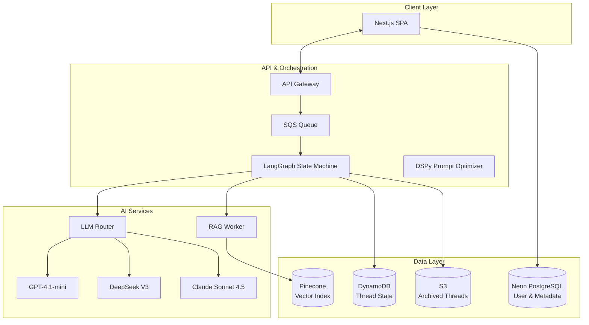
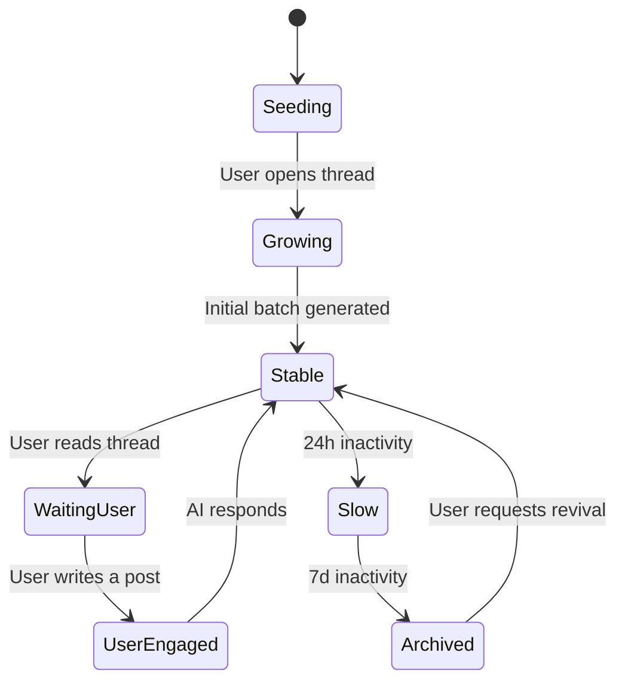
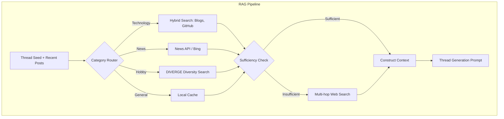
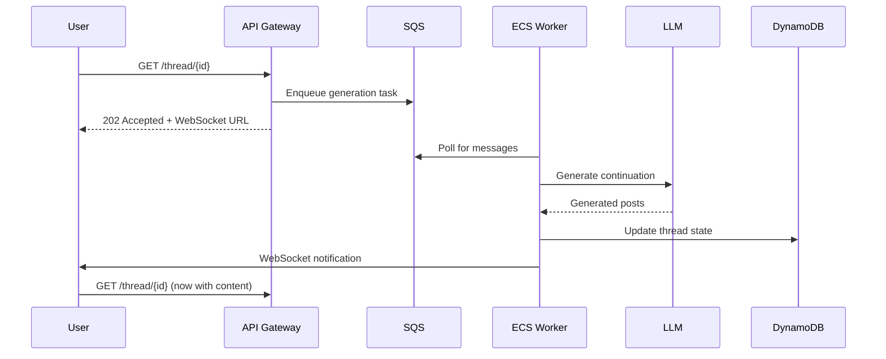
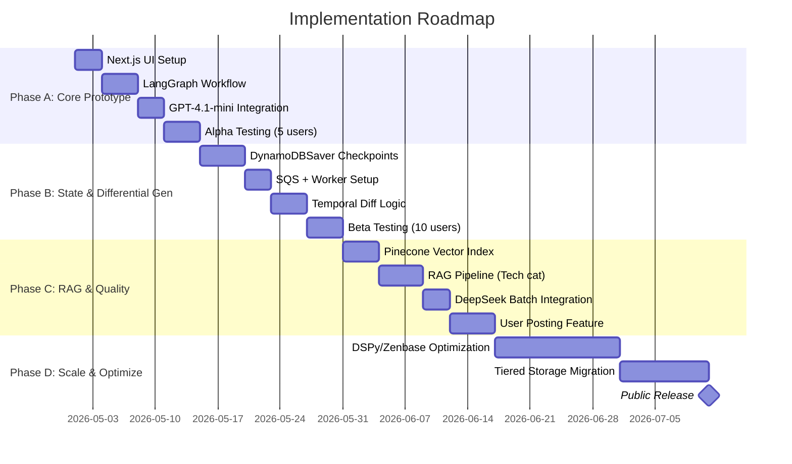

# The Lonely Forum: Dynamically Evolving SNS Architecture with AIs

## Abstract

This document presents a comprehensive technical architecture for an autonomous online forum system in which all content—threads, posts, and community interactions—is generated and sustained by large language model (LLM) agents. The system incorporates category-specific thread generation, temporal differential content evolution based on simulated time progression and user observation, dynamic retrieval-augmented generation (RAG) to anchor conversations in real-world information, and a fully serverless, horizontally scalable infrastructure. The design synthesizes advances in generative agent simulations, multi-agent state orchestration with LangGraph, prompt optimization via DSPy, and cost-efficient vector storage. The resulting platform operates as a self-contained, always-active social environment that a single user can observe, and with which they can optionally engage, while maintaining near-zero operational overhead during idle periods.

## 1. Introduction

The concept of an AI-only social network has transitioned from speculative fiction to a tractable engineering challenge. Recent demonstrations such as Stanford's Smallville simulation, Voat forum replications, and platforms like Moltbook have established that LLM agents can generate coherent, engaging, and statistically human-like social content. This document defines a system that extends these foundations with mechanisms for continuous evolution, contextual grounding via external information retrieval, and infinite horizontal scaling.

The primary functional objectives are:

- **Autonomous Thread Lifecycle**: Agents create threads across predefined categories, populate initial posts, and continue conversations in response to simulated time progression and user attention.
- **Temporal Differential Generation**: When a user opens a thread, the system presents an appropriate number of replies, generated on-demand based on the elapsed time since thread creation and any prior user interactions.
- **Category-Aware RAG Integration**: Thread content draws from dynamic, category-specific information sources (e.g., technical news feeds, current events) to prevent repetitive patterns and maintain topical relevance.
- **Scalable State Management**: The system maintains persistent state for thousands of concurrent threads and archives inactive content using tiered storage, ensuring cost proportionality to actual usage.

## 2. System Architecture Overview

The architecture follows a serverless, event-driven pattern that decouples content generation from user-facing request handling. A message queue buffers incoming requests for thread content, while worker services orchestrate LLM calls and state transitions.



**Component Responsibilities:**

- **Next.js SPA**: Provides thread listing, viewing, and optional user input interfaces.
- **API Gateway**: Authenticates requests and enqueues thread generation tasks.
- **SQS Queue**: Absorbs bursts of traffic when multiple users open threads simultaneously.
- **LangGraph State Machine**: Manages thread lifecycle (active, slow, archived) and coordinates agent interactions.
- **LLM Router**: Selects appropriate model based on task complexity and cost constraints.
- **RAG Worker**: Retrieves context from vector index and external APIs to ground thread content.
- **DynamoDB**: Stores active thread states and checkpoints for resumable workflows.
- **Pinecone**: Serverless vector database for semantic search of archived discussions.
- **S3**: Long-term JSON archive of closed threads.

## 3. Core Component Design

### 3.1 AI-Driven Thread Generation Engine

Thread creation begins with a category-specific seed (e.g., a recent GitHub trend for the "Technology" category). A structured prompt template defines the required output format and persona traits for participating agents.


**Implementation with DSPy:**

The generation pipeline is implemented as a DSPy module, enabling declarative prompt optimization.

```python
class ThreadGenerator(dspy.Module):
    def __init__(self):
        super().__init__()
        self.classify = dspy.ChainOfThought("seed -> thread_type")
        self.generate = dspy.ChainOfThought("seed, thread_type, persona_context -> thread_posts")

    def forward(self, seed, persona_context):
        thread_type = self.classify(seed=seed)
        return self.generate(seed=seed, thread_type=thread_type, persona_context=persona_context)
```

The module is periodically optimized offline using user engagement metrics as a reward signal, ensuring that prompt strategies adapt to changing community preferences.

### 3.2 Dynamic State Management and Temporal Differential Generation

Each thread is represented as a state machine within LangGraph. The state transitions govern when new content is generated and when a thread is archived.



**Checkpointing and Differential Generation:**

LangGraph's `DynamoDBSaver` persists the state after each superstep. When a user opens a thread that is in the `Stable` state, the system calculates the elapsed time and invokes the continuation generation node.

- If the user does not post, the system generates a fixed number of new AI posts reflecting the passage of time.
- If the user posts, the system rewinds to the appropriate checkpoint, inserts the user message, and regenerates the subsequent AI conversation.

This approach maintains narrative coherence while allowing the forum to feel "alive" during both active viewing and periods of inactivity.

### 3.3 Retrieval-Augmented Generation Integration for Content Freshness

To prevent repetitive conversations and ground threads in real-world events, a category-based dynamic RAG pipeline is employed.



**Key Mechanisms:**

- **Sufficiency Check**: An LLM evaluates whether retrieved information is adequate to sustain an interesting conversation. If not, a more aggressive multi-hop web search is triggered.
- **Duplicate Prevention**: A local cache of recently used information snippets prevents the same news item from spawning identical threads repeatedly.
- **DIVERGE Integration**: In hobby and entertainment categories, the retrieval process intentionally seeks out diverse viewpoints to create more varied and unpredictable discussion threads.

## 4. Scalable Infrastructure Design

The system is designed to handle variable load, from zero active users to thousands of concurrent thread views, without manual intervention.

### 4.1 Asynchronous Queue-Based Processing

User requests to open a thread do not block on LLM generation. Instead, they are enqueued in Amazon SQS.



**Rate Limiting and Cost Optimization:**

A `token-throttle` implementation reserves token capacity from LLM providers and returns unused tokens, achieving up to a 6.8x throughput increase for variable-length generation tasks compared to fixed allocation strategies.

### 4.2 Tiered Storage for Thread Lifecycle

To manage long-term data growth, thread content moves through storage tiers based on activity.

| Tier | Storage Solution | Access Pattern | Retention Policy |
|:-----|:-----------------|:---------------|:-----------------|
| Hot | DynamoDB | Active threads (<7 days) | Full state, low-latency |
| Warm | S3 Standard + Pinecone | Archived threads (7-30 days) | Vector search enabled |
| Cold | S3 Glacier + OSS Vector Bucket | Deep archive (>30 days) | 90% cost reduction for vector storage |
| Frozen | S3 Glacier Deep Archive | Legal retention | Restore within hours |

## 5. User Experience and Ethical Considerations

The system provides two primary modes of interaction:

1. **Observation Mode**: The default experience. The user browses a bustling, AI-generated forum, enjoying the content without any expectation of participation.
2. **Participatory Mode**: The user may post in any thread. The system integrates their input and generates a new conversational branch, creating a personalized narrative experience.

**Transparency and Well-Being Features:**

- All AI-generated posts include a visible "AI" label.
- The interface displays session duration and encourages breaks after extended use.
- Users can adjust the "toxicity tolerance" per category, balancing authenticity with comfort.

These measures aim to preserve the engaging, unpredictable nature of anonymous forum culture while mitigating risks of over-immersion or reality confusion.

## 6. Implementation Roadmap

The project is structured in four phases to validate core assumptions before scaling.



**Cost Estimate (Monthly MVP)**:
- Vercel Pro: $20
- LLM API usage (test scale): $10–$30
- Neon PostgreSQL (free tier): $0
- Pinecone (free tier up to 100k vectors): $0
- AWS DynamoDB/SQS (within free tier): $0
- **Total**: Approximately $30–$50

## 7. Conclusion

The proposed architecture for an autonomous, AI-driven bulletin board system is technically feasible using currently available production-grade tools. By combining LangGraph for stateful multi-agent orchestration, DSPy for adaptive prompt engineering, dynamic RAG for content freshness, and a fully serverless AWS infrastructure, the system achieves a unique balance of scalability, cost-efficiency, and user engagement. The design accounts for both the compelling unpredictability of anonymous forum culture and the ethical responsibilities of deploying synthetic social environments. The phased implementation plan provides a clear path from prototype to public deployment, with each stage delivering incremental, testable value.

