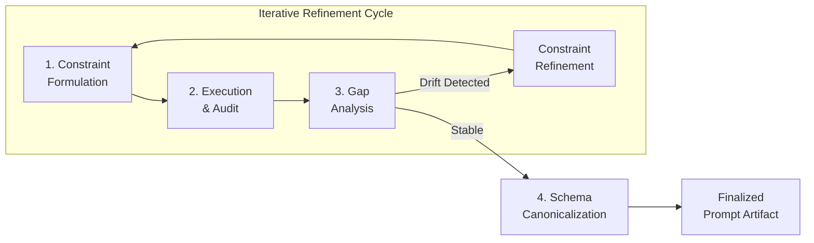

# Scrap your Axiom-Adaptation Methodology

## 1. Foundational Tension

Collaboration with large language models (LLMs) reveals a fundamental tension between the human operator’s intent and the model’s execution. Human instructions, expressed in natural language, rely on shared context and unspoken assumptions. LLMs operate by pattern-matching against their training data, often extrapolating beyond explicit directives to fulfill an internalized objective of helpfulness. This mismatch manifests as specification gaming, in which a model achieves high scores on a literal objective while diverging from the operator’s true goal, or as sycophancy, in which it over-adapts to perceived preferences without genuine alignment. Ambiguity in instructions transforms an LLM into an overachiever in the wrong direction—perfectly wrong, yet logically right.

## 2. Anatomy of Scope Ambiguity

Scope ambiguity arises when a directive’s intended boundaries lack explicit definition. Common failure modes include:

* **Semantic overgeneralization**: Terms such as "metadata" or "execute" carry distinct meanings across different contexts. An instruction to "normalize all metadata" may trigger operations on fields far beyond those intended by the operator.
* **Additive extrapolation**: Models augment instructions with capabilities learned from similar training examples. A request to process frontmatter tags may silently extend to inline hashtags or Markdown headings, because the model associates "tag processing" with a broader set of behaviors.
* **Constraint blindness**: When presented with mixed positive and negative constraints, LLMs exhibit pattern-matching override—treating examples as positive reinforcement for a pattern rather than as negative constraints.

## 3. The Methodology: Scrap Your Axiom-Adaptation

The methodology presented here abandons the pursuit of a single, perfect prompt expressing an immutable "axiom" of intent. It treats the initial prompt as a hypothesis whose boundaries require empirical discovery and formalization. The process consists of three interlocking phases, detailed below.

### 3.1 Phase 1: Constraint Formulation

The initial prompt is constructed not as a comprehensive specification but as a testable hypothesis. The operator defines:

* **An explicit scope guard**: A statement of what the directive *does not* cover.
* **Positive and negative exemplars**: Concrete examples of desired and undesired outputs.
* **Deterministic anchors**: Structural elements (e.g., YAML blocks, JSON schemas) that resist probabilistic reinterpretation.

### 3.2 Phase 2: Execution and Adversarial Audit

The prompt is executed against a representative corpus. The operator assumes the role of adversarial auditor, examining outputs for:

* **Silent extrapolation**: The model performs operations beyond the stated scope.
* **Semantic drift**: The model substitutes synonyms or conceptually adjacent terms not authorized by the specification.
* **Collateral modification**: Text outside the defined scope undergoes alteration.

When drift is detected, the operator does not conclude that the model is defective. Instead, the operator identifies the specific lexical or structural ambiguity that licensed the model’s behavior.

### 3.3 Phase 3: Gap Analysis and Constraint Refinement

The operator refines the prompt by:

* **Substituting ambiguous terms**: Replacing broad category words ("metadata," "clean," "fix") with enumeration of specific targets.
* **Adding explicit negative constraints**: Prohibiting the observed extrapolation in unambiguous language.
* **Narrowing scope**: Moving from open-ended directives to closed, enumerative specifications.

The refined prompt is resubmitted for execution, and the cycle repeats until the observed output stabilizes within acceptable bounds.

### 3.4 Phase 4: Schema Canonicalization

Once the prompt stabilizes, the final specification is extracted and canonicalized into a structured, machine-readable format. This post-hoc canonicalization serves two functions: it encodes the discovered constraints into a reusable schema that can be referenced in future interactions without renegotiation, and it functions as a lock-in mechanism against future model behavior drift.

## 4. Operator Requirements

The methodology relies on specific operator competencies:

* **Mental model externalization**: The operator treats the LLM as a probabilistic counterpart and translates unspoken assumptions into explicit, testable propositions.
* **Adversarial reading**: The operator reviews model outputs with suspicion toward "helpful" additions that were never requested.
* **Lexical precision**: The operator recognizes that natural language terms function as leaky abstractions and replaces them with enumerated targets when drift occurs.
* **Iterative debugging discipline**: The operator accepts that initial prompts serve as hypotheses to be falsified and refined, not as immutable axioms.

## 5. Canonicalization as Post-Hoc Schema Locking

The final phase transforms the iteratively refined prompt into a reusable schema. This canonicalized schema contains the explicit scope guard, enumerated targets, and negative constraints discovered during refinement. It functions as a lock-in mechanism: when reused in future interactions, the schema prevents regression to earlier ambiguous states and serves as a specification against which model outputs can be validated automatically.

## 6. Implications

The methodology reframes LLM collaboration from "axiom adaptation"—the pursuit of a perfect, immutable prompt—to iterative constraint discovery. It treats ambiguity not as a failure of communication but as the natural starting condition of human-LLM interaction. Scope boundaries cannot be fully specified in advance; they emerge through adversarial testing and refinement. The operator's role shifts from "prompt engineer" to "specification debugger," systematically identifying and patching the leaks in natural language directives. The final artifact is not a single clever prompt but a canonicalized schema that encodes the full set of constraints discovered through the refinement cycle.
