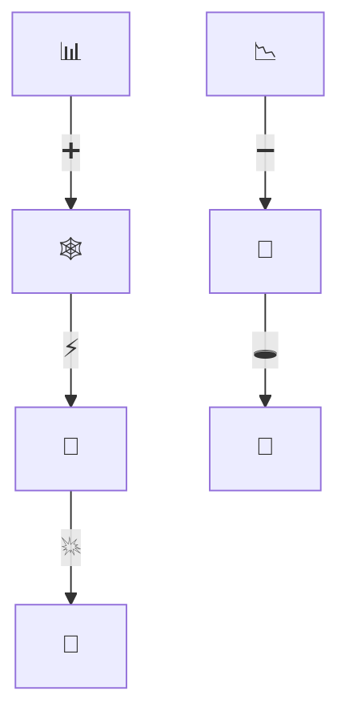
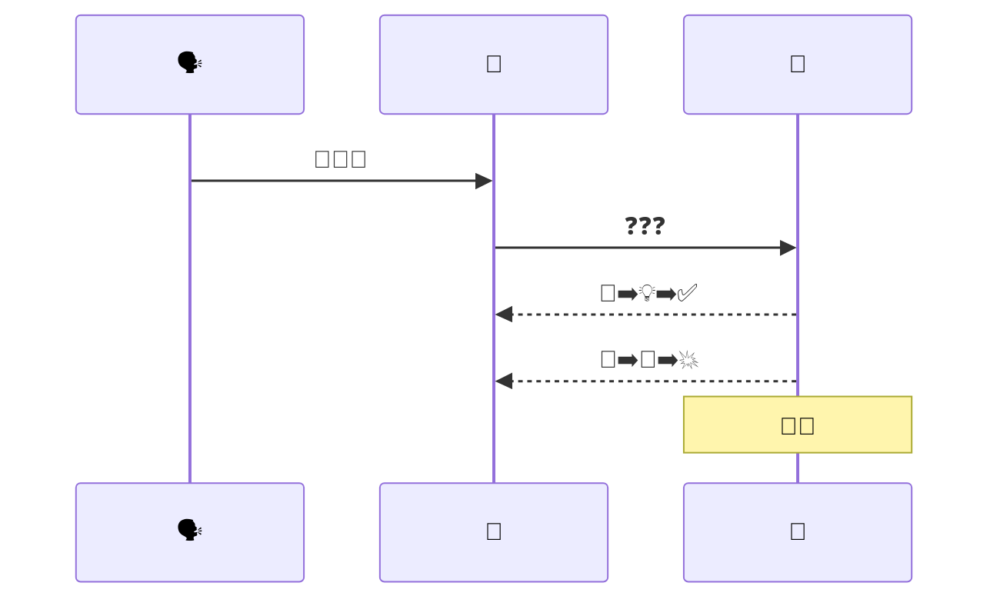
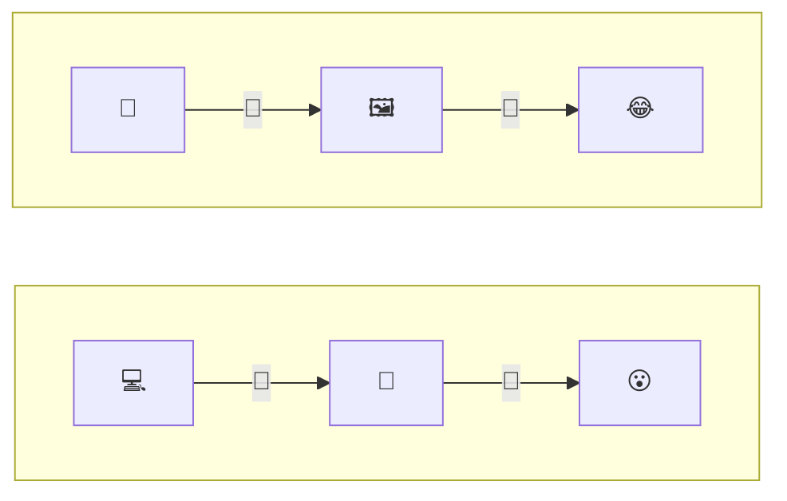
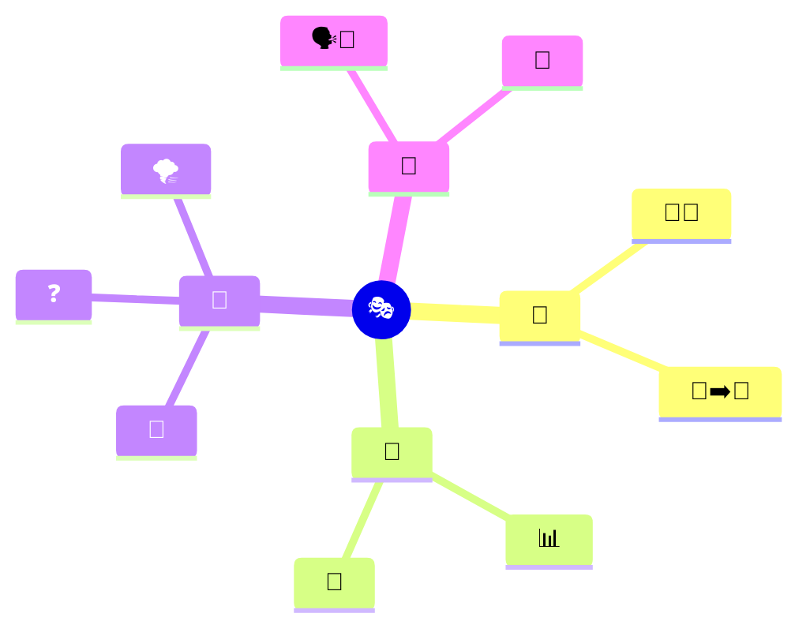
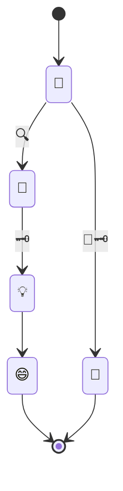
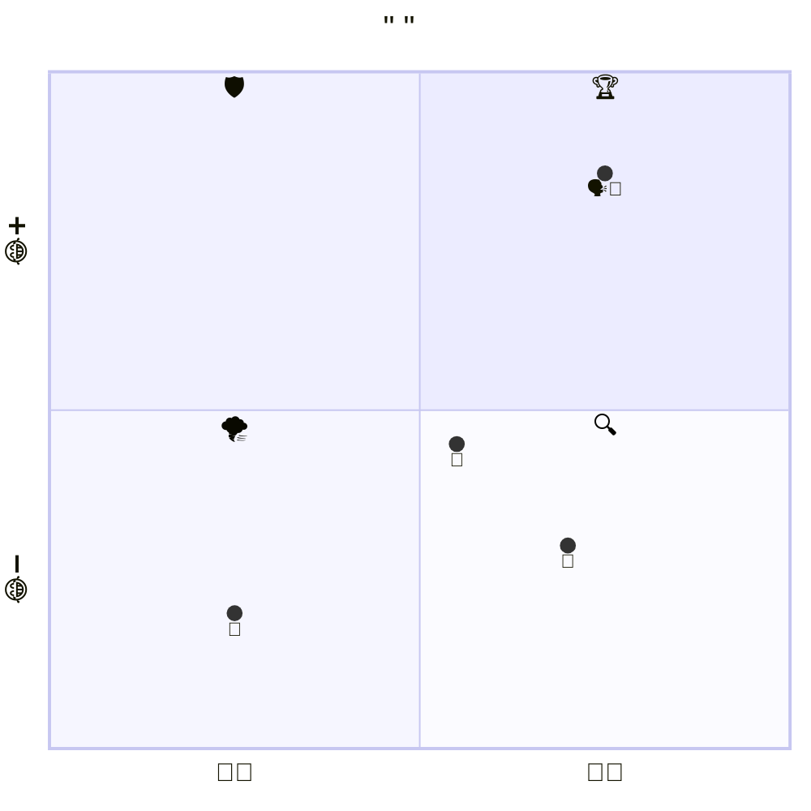

# The Amazing Emoji Diagram

## 1. Foundational Properties of Emoji Ambiguity

Quantitative analysis of 1,289 emoji types indicates that only 1.2% exhibit no contextual ambiguity when presented in isolation. A further 4.3% demonstrate extreme ambiguity, with interpretation variance statistically indistinguishable from random word assignment. This inherent polysemy intensifies in the absence of accompanying text. Without anchoring linguistic cues, an emoji's semantic range expands to include multiple, often contradictory, referents. The interpretative process shifts from decoding a fixed signal to navigating a field of potential meanings.

```mermaid
graph TD
    subgraph A[ ]
        direction LR
        🧠[🧠]
    end
    subgraph B[ ]
        direction LR
        🛡️[🛡️]
        🔒[🔒]
        🏹[🏹]
    end
    subgraph C[ ]
        direction LR
        🌐[🌐]
        ❓[❓]
    end
    🧠 --> 🛡️
    🧠 --> 🔒
    🧠 --> 🏹
    🛡️ -.-> 🌐
    🔒 -.-> ❓
    🏹 -.-> ❓
```

## 2. Diagrammatic Form and Visual Incongruity

Flowcharts, Venn diagrams, and sequence diagrams carry an implicit expectation of logical, objective representation. When the content of such diagrams diverges from this formal expectation—specifically, when a rigorous syntactic structure is populated with non‑propositional, playful symbols—an incongruity is perceived. The juxtaposition of a deterministic branching structure with the fluid semantics of emoji creates a cognitive tension. This tension is resolved through the recognition of a meta‑communicative frame: the diagram is not a literal instruction set but a playful construct. The resolution of this formal incongruity is the primary generator of visual humor in the emoji‑only diagram.



## 3. Cryptographic and Ludic Practices in Digital Culture

The use of emoji as a constrained, puzzle‑like communication system is a documented cultural practice. Dedicated applications such as EmojiChat facilitate entire conversations composed solely of pictograms. Emoji rebus puzzles, found in mobile games and social media challenges, frame the act of interpretation as a competitive or cooperative game. Online communities host challenges that reward the creation of narratives from a fixed set of random emoji. Within these contexts, the inherent ambiguity of the emoji is not a communicative deficit. It is the central mechanic of a voluntary, shared game. The receiver shifts from passive interpreter to active co‑constructor of meaning.



## 4. The Dual‑Phase Humor of Mermaid Syntax

Mermaid.js diagrams possess a dual representational layer: the textual source code and the rendered visual graph. An emoji‑only Mermaid diagram generates two distinct, sequential humor events. The first event occurs during the reading of the source code. The presence of formal syntactic tokens such as `graph TD`, `-->`, or `subgraph` in proximity to emoji character strings creates an initial incongruity. The second event occurs upon rendering. The visual output presents a formally correct flowchart, quadrant chart, or sequence diagram composed entirely of pictographic labels. The strict visual grammar of the diagram form conflicts with the playful, non‑linguistic nature of the labels. The perception of both the coded instruction and the graphical output amplifies the total humorous effect.



## 5. Structural Analysis of the Emoji‑Only Mermaid Output

The emoji‑only Mermaid diagram functions as a layered system of benign violations. It simultaneously breaches expectations across five distinct categories: the expected pairing of text labels with diagram nodes; the conventional use of flowcharts for serious or instructional purposes; the linguistic expectation of propositional content; the semiotic stability of written communication; and the normative frame of an LLM‑user interaction. Because the interaction occurs within a low‑stakes, meta‑communicative frame that signals “play,” these violations are interpreted as non‑threatening. The observer's cognitive task becomes one of pattern recognition and playful decryption rather than functional information extraction.



## 6. Cognitive Mechanisms and Resolution Pathways

The reception of an emoji‑only Mermaid diagram aligns with the incongruity‑resolution model of humor comprehension. The perceiver first detects a discrepancy between the expected format of a diagram and the actual, emoji‑laden presentation. This discrepancy constitutes the incongruity phase. The perceiver then invokes an alternative interpretive schema: the diagram is not a flawed information graphic but a deliberately constructed visual pun or cryptographic game. The transition from the initial confusion to the recognition of the playful intent constitutes the resolution phase. The pleasure derived from the output is directly correlated with the efficiency of this cognitive shift.



## 7. Boundary Conditions and Communicative Constraints

The humorous and playful effects of emoji‑only Mermaid diagrams are contingent upon specific preconditions. The recipient requires a functional familiarity with the Mermaid diagramming syntax or, at minimum, the cultural conventions of flowchart and graph visualization. A shared cultural lexicon of emoji semantics between the sender and receiver is also necessary to enable any degree of mutual understanding. Furthermore, the interaction must be situated within a context that permits playful or non‑literal communication. Absent these conditions, the output is perceived as noise—a sequence of uninterpretable symbols lacking a clear communicative function.



## 8. Conclusion

The emoji‑only Mermaid diagram operates as a form of meta‑ludic communication. It extracts the ambiguity of emoji from the domain of communicative failure and repositions it as the central mechanic of a collaborative, humorous act. The syntactic rigidity of the diagram form provides a stable scaffold against which the fluid semantics of emoji are juxtaposed. The dual representation of source code and rendered graph generates a layered humor response. Within the appropriate contextual frame, the output transforms from an ostensible data visualization into a shared cognitive puzzle. The diagram is simultaneously an object of interpretation and a visual statement on the flexible boundaries between signal, symbol, and play.