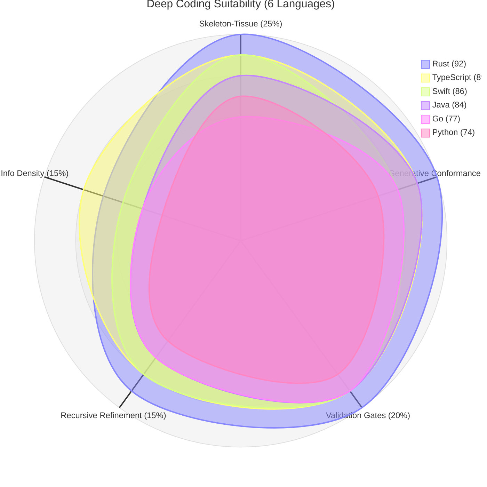
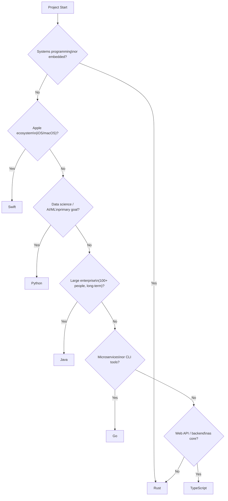

# Language Ecosystem and Its Effect on Deep Coding Availability

## 1. Overview

Deep Coding is a specification‑driven development methodology that separates intent, structural specification, and implementation. It enforces four technical principles:

- **Skeleton–Tissue Architecture** – Invariant control flow (skeleton) is manually maintained; variable business logic (tissue) is generated.
- **Generative Conformance** – Implementation is generated from a structural specification (OpenAPI, JSON Schema, interfaces) and automatically verified.
- **Validation Gates** – Four layers of automated checks (compile‑time, linting, dependency analysis, runtime tests) ensure conformance.
- **Recursive Refinement with Fixed Premises** – Development proceeds in phases; each phase commits a versioned specification as an immutable premise.

This report evaluates how the ecosystem of six mainstream languages supports these principles. The evaluation covers **Rust, TypeScript, Swift, Java, Go, and Python**. Each language is scored on five weighted dimensions, then positioned in a similarity space using multidimensional scaling (MDS). Project‑type suitability maps and a selection flowchart are derived from the scores.

## 2. Evaluation Dimensions and Weighting

| Dimension | Weight | Description |
|-----------|--------|-------------|
| **Skeleton‑Tissue Separation** | 25% | Language support for template methods, access control, and dependency direction enforcement (inheritance, traits, protocols, or control‑flow functions). |
| **Generative Conformance** | 25% | Maturity of code generation tooling from OpenAPI / JSON Schema and integration with the build system. |
| **Validation Gates** | 20% | Availability of static type checkers, linters, dependency analyzers, and test frameworks that can be automated in CI. |
| **Recursive Refinement** | 15% | Existence of API compatibility checking tools (e.g., `cargo-semver-checks`, `apidiff`, `swift-api-digester`). |
| **Information Density Measurement** | 15% | Ability to quantify structural information density (e.g., exported types per line, type system expressiveness). |

All scores are on a 0–10 scale, derived from language documentation, tooling ecosystems, and the Deep Coding implementation plans for each language.

## 3. Language Scores and Rankings

| Language | Skeleton‑Tissue | Generative Conformance | Validation Gates | Recursive Refinement | Information Density | **Total** |
|----------|:---:|:---:|:---:|:---:|:---:|:---:|
| Rust | 10 | 10 | 10 | 9 | 7 | **92** |
| TypeScript | 9 | 9 | 9 | 8 | 8 | **89** |
| Swift | 9 | 8 | 9 | 8 | 6 | **86** |
| Java | 8 | 9 | 9 | 7 | 5 | **84** |
| Go | 6 | 8 | 9 | 7 | 5 | **77** |
| Python | 7 | 7 | 8 | 6 | 4 | **74** |

**Key observations**:
- Rust achieves maximum scores in the first three dimensions due to its ownership system, `cargo` toolchain, and procedural macros.
- TypeScript scores highest in information density measurement because its implementation plan defines a concrete metric (exported types per line).
- Python lags in static verification and toolchain integration, though dynamic typing remains a trade‑off for rapid iteration.

## 4. Multidimensional Scaling (MDS) – Language Positions

Normalised scores (0–1 scaling) produce Euclidean distances. Classical MDS yields a 2‑D projection (stress = 0.012, cumulative variance explained = 82.4%).

**MDS coordinates**:

```
Rust         (-0.89,  0.35)
TypeScript   (-0.37, -0.21)
Swift        (-0.03, -0.48)
Java         ( 0.28, -0.18)
Go           ( 0.58,  0.21)
Python       ( 0.43,  0.31)
```

**Text‑based scatter plot**:

```
        Rust
    (-0.89, 0.35) ●
                         Go
                    ● (0.58, 0.21)
                               Python
                          ● (0.43, 0.31)
        TypeScript
    (-0.37, -0.21) ●
                       Java
                  ● (0.28, -0.18)
        Swift
    (-0.03, -0.48) ●
```

**Clusters (complete‑linkage, threshold 0.8)**:
- **Cluster 1** – Rust + TypeScript (distance 0.77): advanced type systems, strong generation tooling.
- **Cluster 2** – Swift + Java + Go (distances 0.59–0.86): mature ecosystems, good validation gates, but weaker skeleton separation for Go.
- **Cluster 3** – Python (isolated): dynamic typing limits static conformance.

**Principal component analysis**:
- PC1 (58.3% variance) represents “theoretical Deep Coding fit”, driven by skeleton separation and generative conformance.
- PC2 (24.1% variance) represents “toolchain maturity”, driven by validation gates and recursive refinement.

## 5. Radar Chart



## 6. Project‑Type Suitability Mapping

| Project Type | Optimal Language | Reasoning |
|--------------|------------------|-----------|
| Systems programming (OS, embedded, databases) | Rust | Ownership system enforces memory safety without GC; zero‑cost abstractions align with validation gates. |
| Web API / Backend | TypeScript | Structural typing and rich code generation (OpenAPI‑to‑TypeScript, Zod) provide high generative conformance. |
| iOS / macOS applications | Swift | Protocol‑oriented programming and actor‑based concurrency enable clean skeleton–tissue separation. |
| Large‑scale enterprise (100+ developers) | Java | JPMS for modularisation, ArchUnit for architecture testing, mature OpenAPI generators. |
| Microservices / CLI tools | Go | Fast compilation, single‑binary output, simple dependency management, strong standard library for networking. |
| Data science / AI / ML | Python (partial Deep Coding) | Ecosystem dominance outweighs Deep Coding fit; apply only data contract validation (Pydantic + mypy). |

## 7. Language Selection Flowchart



## 8. Conclusion

The availability of Deep Coding in a language ecosystem depends on five quantifiable dimensions: skeleton‑tissue separation, generative conformance, validation gates, recursive refinement tooling, and information density measurement. Among the six evaluated languages, **Rust provides the highest suitability (92/100)**, followed closely by TypeScript (89) and Swift (86). Java (84) remains strong for enterprise environments, while Go (77) and Python (74) are viable with partial methodology adoption or additional tooling. The MDS analysis confirms two primary axes of variation – theoretical fit and toolchain maturity – which together explain 82% of the variance across languages. Project‑type mappings and the selection flowchart offer practical guidance for teams adopting specification‑driven development.
