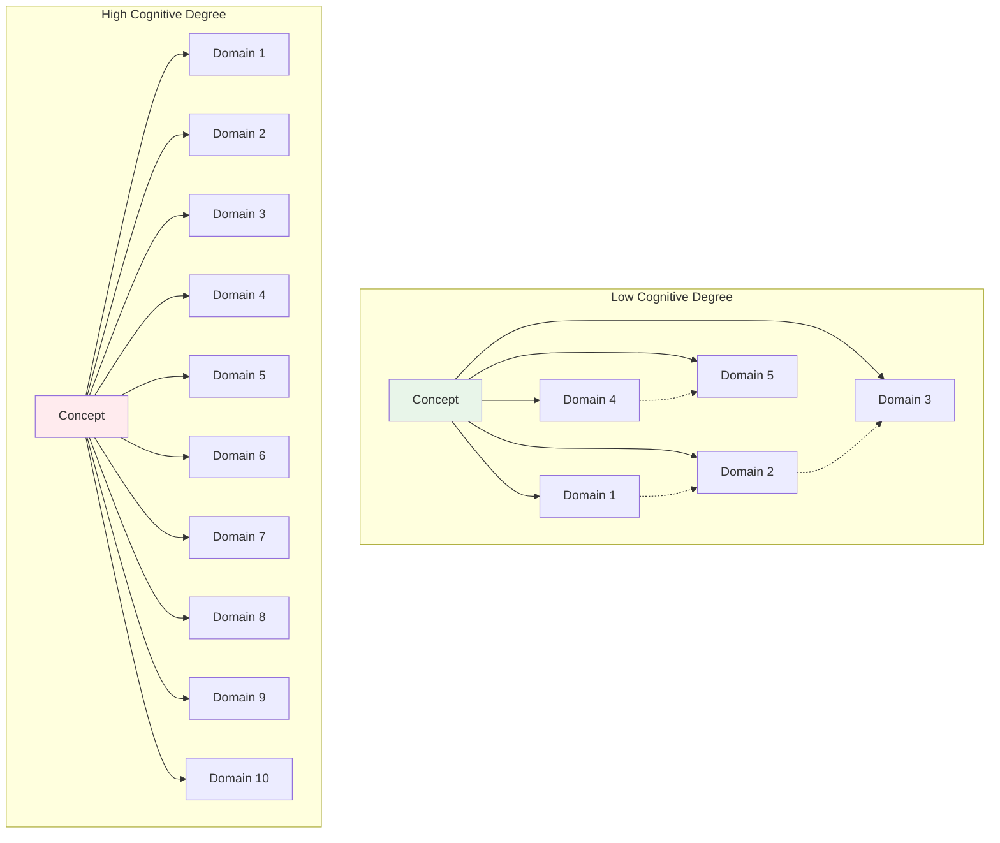
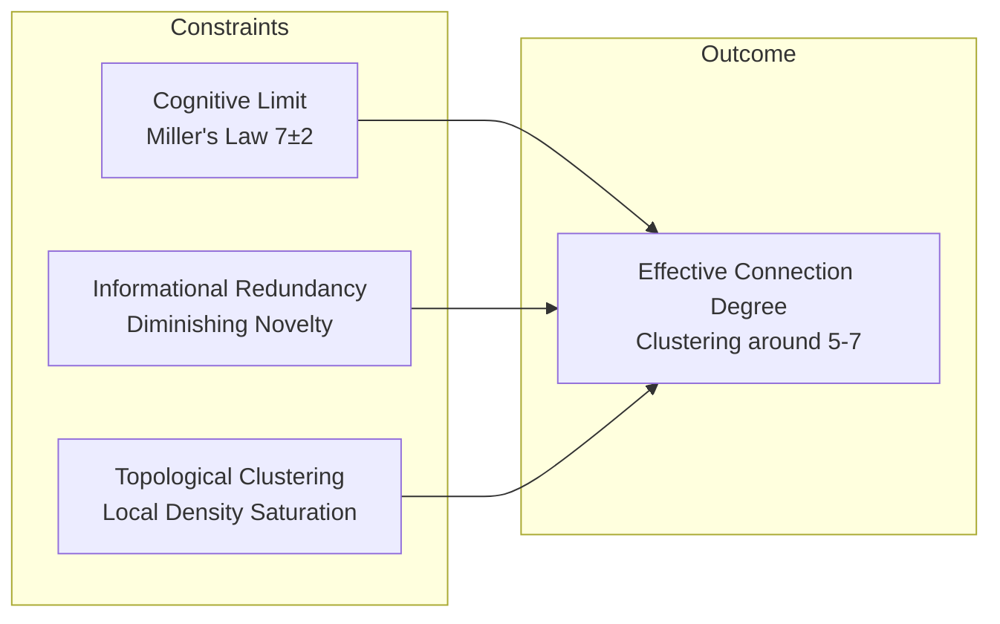

# Tendency of Connection Degree toward Specific Values in Conceptual and Structural Networks

## 1. Introduction

Observational data from extensive interdisciplinary research sessions indicates a recurrent pattern. When a human researcher explores a topic through intuitive querying, the investigation naturally spans approximately five to seven distinct academic or technical domains before reaching a state of perceived completion or diminishing returns. This phenomenon raises a structural hypothesis. The connection degree—the number of meaningful, non-redundant links a conceptual node maintains within a knowledge network—may exhibit a central tendency constrained by intrinsic cognitive and topological factors.

This document examines the theoretical foundations, empirical precedents, and verifiable implications of the hypothesis that concepts, as represented in human knowledge graphs, possess a characteristic connection limit clustering around the range of five to seven.

## 2. Theoretical Foundations

### 2.1 Miller's Law and Cognitive Chunking

The capacity of human working memory for processing distinct informational chunks is established at approximately seven, plus or minus two. This cognitive constraint shapes the architecture of human-generated knowledge structures. Concepts that are frequently accessed and manipulated within working memory are likely to be chunked such that their immediate relational neighborhood does not exceed this cognitive handling capacity.

A concept with a high number of direct connections would impose a cognitive load exceeding working memory limits during recall or reasoning. Consequently, the human mind organizes knowledge into hierarchical or modular structures wherein any single node maintains a bounded number of strong, salient connections. The value of seven, plus or minus two, emerges as a functional ceiling for the number of distinct domains or sub-concepts directly associated with a primary idea during active cognition.

### 2.2 Degree Distribution in Complex Networks

Empirical analyses of real-world networks—including citation networks, semantic networks, and the World Wide Web—reveal degree distributions that follow power-law or log-normal patterns. Within such distributions, the vast majority of nodes possess a low degree, while a small number of hubs exhibit exceptionally high connectivity.

However, the observation from interdisciplinary query sessions pertains not to the statistical degree of all nodes in a static graph, but to the *effective connection count* of a node when traversed by a human researcher engaged in constructive inquiry. The distinction lies between structural degree and cognitive degree. A node may have numerous documented links, yet a human operator consistently navigates only a subset of approximately five to seven before the returns on further exploration diminish or the cognitive context saturates.

### 2.3 Small-World Topology and Clustering

Small-world networks are characterized by high local clustering and short average path lengths. The local clustering coefficient measures the density of connections among a node's neighbors. A node with a cognitive degree in the range of five to seven can achieve high clustering without incurring excessive combinatorial complexity.

A degree significantly below five yields a sparse local structure with limited potential for insightful cross-domain synthesis. A degree significantly above seven introduces cognitive overhead that may trigger natural chunking or abstraction, effectively reducing the perceived number of distinct connections.

## 3. Observational Basis

### 3.1 Interdisciplinary Query Patterns

Analysis of over one hundred intuitive research sessions reveals a consistent structural signature. A query initiates from a seed concept. The exploration branches into related domains—typically numbering between five and seven—before the researcher either converges on a satisfactory synthesis or archives the session. Attempts to incorporate additional domains beyond this range result in one of two outcomes. Either the new domain connections are perceived as redundant with existing ones, or the cognitive load causes the researcher to abstract the cluster into a new, higher-level concept, thereby preserving the effective degree limit.

### 3.2 Examples of Domain Crossings

| Seed Concept | Domains Engaged | Count |
|:---|:---|:---|
| Classical Sci-Fi Silver Bodysuit | Aviation Physiology, Materials Engineering, Aerodynamics, SF Visual Culture, Thermal Control, Impact Protection | 6 |
| Emoji-Only Mermaid Diagrams | Communication Studies, Humor Research, Semiotics, Graph Theory, Visual Perception | 5 |
| AI Over-Seriousness and Humor | Reinforcement Learning, Constitutional AI, Incongruity Theory, Pataphysics, Multi-Agent Systems | 5 |
| Historical Knowledge Graph Infrastructure | Digital Humanities, CIDOC CRM, RDF Triplestores, Version Control Systems, Provenance Tracking, Collaborative Governance | 6 |

The count of engaged domains rarely exceeds seven, even when the underlying knowledge graph contains numerous additional potential links.

## 4. Proposed Mechanism

The convergence on a degree range of five to seven emerges from the interaction of three constraints.

**Cognitive Limit** dictates the maximum number of distinct contexts a human can simultaneously manipulate without resorting to abstraction or external memory aids.

**Informational Redundancy** arises because knowledge domains are themselves interconnected. Adding a seventh or eighth domain often revisits territory already covered by the first five, yielding progressively smaller marginal informational gain.

**Topological Clustering** describes the natural formation of dense local neighborhoods. Once a concept is linked to five to seven others, the probability that those neighbors are already interconnected becomes high, obviating the need for further direct connections.

## 5. Relationship to Knowledge Graph Degree Distributions

The observation does not contradict the existence of high-degree hub nodes in large-scale knowledge graphs. Instead, it posits a distinction between *structural degree* and *functional cognitive degree*.

| Degree Type | Definition | Typical Range |
|:---|:---|:---|
| Structural Degree | Total number of documented edges incident to a node in a complete knowledge graph. | Highly variable; can exceed 100 for hubs. |
| Functional Cognitive Degree | Number of distinct domain-level connections actively utilized by a human researcher during a bounded inquiry session. | 5–7 |

A hub node in a citation network may possess hundreds of inbound citations, yet a researcher exploring that node will sample only a subset of those connections before the cognitive context saturates. The observed limit of five to seven reflects human information processing capacity rather than a fundamental property of the knowledge graph's static structure.

## 6. Verifiable Implications

The hypothesis generates several testable predictions.

| Prediction | Verification Method | Data Requirement |
|:---|:---|:---|
| The modal number of distinct academic disciplines cited in highly interdisciplinary papers falls within the range of five to seven. | Large-scale bibliometric analysis of cross-disciplinary citation patterns. | Citation databases with discipline tagging. |
| User query sessions in AI-assisted research platforms exhibit a median number of distinct domain shifts between five and seven before session termination or topic exhaustion. | Log analysis of interactive research sessions. | Session logs from AI research assistants. |
| When humans construct concept maps, the average degree of central nodes, when controlled for node abstraction level, clusters around five to seven. | Experimental elicitation of concept maps across diverse topics. | Controlled human subject data. |

The advent of AI-mediated research at scale will generate datasets suitable for testing these predictions at low marginal cost.

## 7. Conclusion

A recurring pattern observed in extensive interdisciplinary research practice suggests that conceptual nodes, when actively engaged by human cognition, exhibit an effective connection degree that clusters within the range of five to seven. This phenomenon aligns with established cognitive limits, the statistical properties of complex networks, and the informational economics of exploratory search. The observed range represents a balance point where the local neighborhood of a concept is sufficiently rich to support novel synthesis yet sufficiently bounded to remain cognitively tractable. Formal verification of this hypothesis awaits the accumulation of large-scale interaction data from AI-augmented research environments.